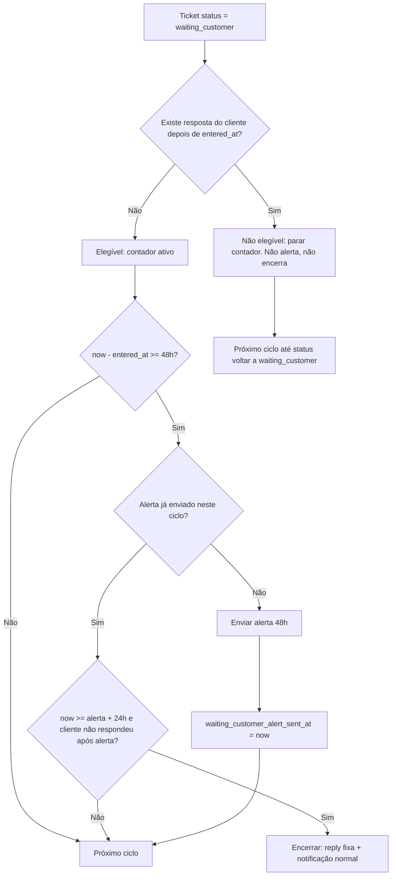

# Automação: Fechamento automático por falta de interação (aguardando cliente)

## Regra central: quando o contador existe

**A validação não pode ser só "status = aguardando cliente".**  
Precisa ser: **status = "aguardando cliente" E não teve nenhuma resposta do cliente depois disso.**

- Coloquei em aguardando cliente → **começo** a contar 48h + 24h.
- **Cliente respondeu** (qualquer coisa: "obrigado", "funcionou", reabertura, etc.) → **paro de contar**. O sistema já tem automação que reabre o chamado ou mantém aguardando cliente conforme a resposta. Independente do que ele respondeu, paramos: não enviamos alerta de 48h, não encerramos em 24h.
- **Status saiu de "aguardando cliente"** (ex.: reaberto, em andamento, resolvido) → o contador **deixa de existir**. Quando o atendente colocar de novo em "aguardando cliente", isso gera **novo** registro no histórico → o contador **recomeça** as 48h + 24h a partir desse novo momento.

Ou seja: **estamos no contador** se e só se:
1. Status atual = `waiting_customer`
2. **E** não existe nenhuma resposta do cliente com `created_at` **posterior** à data em que o status foi (pela última vez) para "aguardando cliente".

---

## Implementação da validação

**Dados por ticket:**

- **entered_at** = data em que o status foi (pela última vez) para "aguardando cliente"  
  → último registro em `ticket_status_history` com `ticket_id`, `change_type = 'status'`, `new_status = 'waiting_customer'` → usar `created_at`.
- **last_customer_reply_at** = data da última resposta do cliente nesse ticket  
  → `max(created_at)` em `ticket_replies` onde `ticket_id` = X e `user_id` = usuário do cliente desse ticket (`tickets.customer_id` → `customers.user_id`). Se não houver resposta do cliente, considerar `null`.

**Elegível para a automação (contador ativo):**

- `entered_at` existe (o ticket entrou em waiting_customer pelo menos uma vez na “última vez”).
- **E** `last_customer_reply_at` é `null` **ou** `last_customer_reply_at < entered_at`.  
  Ou seja: **nenhuma resposta do cliente depois de ter entrado em aguardando cliente.**

Se o cliente respondeu em qualquer momento **depois** de `entered_at`, o ticket **não** é elegível: não enviamos alerta, não encerramos. Só voltamos a considerar quando o status for alterado de novo para "aguardando cliente" (novo `entered_at`).

---

## Fluxo da automação (48h e 24h)

**Só para tickets elegíveis** (status = waiting_customer e nenhuma resposta do cliente desde `entered_at`):

1. **Alerta 48h**  
   Se `(now - entered_at) >= 48h` **e** ainda não enviamos o alerta neste ciclo (`waiting_customer_alert_sent_at` é null):  
   - Enviar e-mail de alerta ("ticket será encerrado em 24h por falta de interação").  
   - Gravar `waiting_customer_alert_sent_at = now()`.

2. **Encerramento 24h após o alerta**  
   Se enviamos o alerta (`waiting_customer_alert_sent_at` preenchido), já passaram 24h (`now >= waiting_customer_alert_sent_at + 24h`) **e** o cliente **não** respondeu depois do alerta (`last_customer_reply_at` null ou `last_customer_reply_at <= waiting_customer_alert_sent_at`):  
   - Encerrar o ticket (reply "Ticket encerrado por falta de interação", status resolved, notificação normal de ticket encerrado).

3. **Se o cliente responder depois do alerta**  
   No fluxo que cria a resposta no ticket, quando a reply for **do cliente**:  
   - Zerar `waiting_customer_alert_sent_at = null` (para não encerrar em 24h).  
   - Na próxima corrida do scheduler, o ticket deixa de ser elegível (`last_customer_reply_at > entered_at`), então não enviamos novo alerta e não encerramos. Só voltamos a contar quando alguém colocar o status de novo em "aguardando cliente".

---

## Diagrama do fluxo

**Quando o status deixa de ser waiting_customer** (ex.: reaberto): o contador deixa de existir. Quando o atendente colocar de novo em "aguardando cliente", um **novo** `entered_at` é gerado no histórico → contador recomeça 48h + 24h a partir daí.

---

## Resumo

| Situação | O que faz |
|----------|-----------|
| Status = waiting_customer, **nenhuma** resposta do cliente desde que entrou nesse status | Contador ativo: 48h → alerta; +24h → encerrar (se não respondeu após o alerta). |
| Cliente respondeu (qualquer coisa) depois de estar em waiting_customer | **Parar de contar.** Não alerta, não encerra. Zerar `waiting_customer_alert_sent_at` se existir. |
| Status saiu de waiting_customer (ex.: reaberto) | Contador deixa de existir. |
| Atendente coloca de novo em waiting_customer | **Novo** `entered_at` → contador **recomeça** 48h + 24h. |

---

## Parâmetro no departamento (campo, tabela e UI)

Sim. O plano prevê os três pontos:

**1. Campo na tabela de departamento**

- Nova coluna em `departments`: `auto_close_waiting_customer boolean NOT NULL DEFAULT false`.
- Migration em `db/migrations/` (ex.: `088_auto_close_waiting_customer.sql`).
- Atualizar `shared/schema.ts` na definição da tabela `departments`.

**2. API de departamento**

- Rotas que leem/atualizam departamento (GET por id, PATCH/PUT) devem **incluir** e **persistir** o campo `auto_close_waiting_customer` (leitura no retorno e escrita no body da atualização em `server/routes.ts` ou onde estiver a API de departments).

**3. UI (formulário de departamento)**

- Em `client/src/pages/DepartmentManagement.tsx`:
  - Incluir `auto_close_waiting_customer` no estado do formulário (`DepartmentFormData`) e no submit (enviar no PATCH).
  - Novo **Switch** no formulário (criar/editar departamento), no mesmo padrão dos switches "Pesquisa de satisfação" e "Prestadores de serviços":
    - Label: algo como "Fechamento automático por falta de interação".
    - Descrição: ex. "Encerrar automaticamente tickets em aguardando cliente após 48h sem resposta do cliente (alerta em 48h, encerramento em 72h)."
- i18n: adicionar chaves em `client/src/i18n/messages/pt-BR.json` e `en-US.json` para label e descrição do switch (ex.: `departments.add_department_dialog.auto_close_waiting_customer` e `auto_close_waiting_customer_desc`).

A automação só considera tickets de departamentos que tiverem `auto_close_waiting_customer = true`.

---

## Demais pontos do plano (resumo)

- Janela de execução: 6h–21h (mesmo scheduler).
- Novo layout de e-mail: `waiting_customer_closure_alert` (criar layouts padrão); disparo obrigatório (ignora regras de notificação).
- Coluna em tickets: `waiting_customer_alert_sent_at`; zerar quando o cliente responde (reply do cliente no fluxo de criação de resposta).
- Encerramento: reply "Ticket encerrado por falta de interação", status resolved, notificação normal de ticket encerrado.
