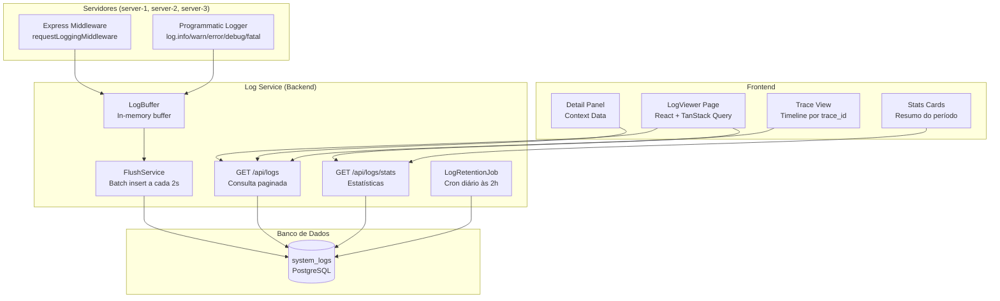
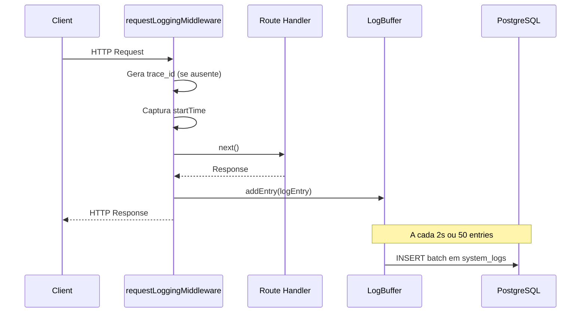

# Design — Sistema Centralizado de Logging em Banco de Dados

## Visão Geral

Este design descreve a migração do sistema de logging atual (Winston escrevendo em arquivos `.txt`) para um sistema centralizado em banco de dados PostgreSQL. A solução substitui os múltiplos loggers Winston (`logger`, `performanceLogger`, `securityLogger`) por um serviço unificado que persiste logs na tabela `system_logs`, mantendo compatibilidade com a API do Winston durante a migração.

A arquitetura segue o padrão existente do projeto: Drizzle ORM para schema/queries, Express middleware para captura automática, TanStack Query no frontend, e `node-cron` para jobs periódicos (mesmo padrão do `CleanupScheduler`).

### Decisões de Design

1. **Escrita assíncrona com buffer**: Logs são acumulados em um buffer em memória e persistidos em batch a cada 2 segundos (ou quando o buffer atinge 50 entradas), evitando impacto no tempo de resposta das requisições.
2. **Cursor-based pagination**: Ao invés de offset-based, usamos cursor no `id` para paginação eficiente em datasets grandes.
3. **Compatibilidade Winston**: O novo logger expõe a mesma interface (`log.info`, `log.warn`, `log.error`, etc.) para migração gradual.
4. **Retenção via `node-cron`**: Job diário às 2h (antes do cleanup de notificações às 3h), usando o mesmo padrão do `CleanupScheduler`.
5. **Multi-tenant nativo**: `company_id` em cada log entry, com filtragem automática no middleware de autorização.

## Arquitetura



### Fluxo de uma Requisição HTTP



## Componentes e Interfaces

### 1. Schema Drizzle — `system_logs` (shared/schema.ts)

Nova tabela adicionada ao schema existente, seguindo os mesmos padrões de nomenclatura snake_case e uso de `serial`, `text`, `timestamp`, `integer`, `jsonb`.

### 2. LogBuffer (server/services/log-buffer.ts)

Classe singleton responsável por acumular log entries em memória e fazer flush periódico.

```typescript
interface LogEntryInput {
  level: 'debug' | 'info' | 'warn' | 'error' | 'fatal';
  message: string;
  server_identifier: string;
  trace_id?: string;
  span_id?: string;
  context_data?: Record<string, unknown>;
  company_id?: number | null;
  user_id?: number | null;
  request_method?: string;
  request_url?: string;
  response_status?: number;
  response_time_ms?: number;
}

class LogBuffer {
  private buffer: LogEntryInput[] = [];
  private flushInterval: NodeJS.Timeout | null = null;
  private readonly MAX_BUFFER_SIZE = 50;
  private readonly FLUSH_INTERVAL_MS = 2000;

  start(): void;           // Inicia o timer de flush
  stop(): Promise<void>;   // Flush final e para o timer
  add(entry: LogEntryInput): void;  // Adiciona ao buffer, flush se cheio
  private flush(): Promise<void>;   // INSERT batch no banco
}
```

### 3. Logger Programático (server/services/db-logger.ts)

Wrapper que expõe a interface familiar `log.info()`, `log.warn()`, etc., delegando ao `LogBuffer`.

```typescript
interface DbLogger {
  debug(message: string, context?: Record<string, unknown>): void;
  info(message: string, context?: Record<string, unknown>): void;
  warn(message: string, context?: Record<string, unknown>): void;
  error(message: string, context?: Record<string, unknown>): void;
  fatal(message: string, context?: Record<string, unknown>): void;
  setTraceContext(traceId: string, spanId?: string): void;
  setUserContext(userId: number, companyId: number): void;
}
```

Mantém compatibilidade com chamadas existentes do Winston (`logger.info(...)`, `logger.error(...)`) durante a migração.

### 4. Request Logging Middleware (server/middleware/request-logging.ts)

Middleware Express que substitui o `performanceMiddleware` atual para captura automática de requisições HTTP.

```typescript
function requestLoggingMiddleware(req: Request, res: Response, next: NextFunction): void;
```

Responsabilidades:
- Gerar `trace_id` (UUID v4) se não presente no header `x-trace-id`
- Gerar `span_id` para a requisição
- Capturar `startTime` via `performance.now()`
- No evento `res.finish`: calcular duração, extrair user_id/company_id da sessão, montar `LogEntryInput` e adicionar ao buffer
- Se `response_time_ms > 1000`: registrar log adicional com nível `warn` e decomposição de tempo

### 5. API de Consulta (server/api/logs-api.ts)

Dois endpoints protegidos por `authRequired` + `adminRequired` (ou `companyAdminRequired`):

**GET /api/logs**
- Query params: `level`, `server_identifier`, `trace_id`, `company_id`, `user_id`, `request_url`, `date_from`, `date_to`, `search`, `context_filter`, `cursor`, `limit` (default 50)
- Cursor-based pagination usando `id` decrescente
- Filtragem automática por `company_id` para não-super_admin
- Super_admin pode passar `company_id` como filtro ou omitir para ver todos

**GET /api/logs/stats**
- Query params: `date_from`, `date_to`, `company_id`
- Retorna: contagem por nível, contagem por servidor, média de response_time_ms, contagem de erros, contagem de requisições lentas (>1000ms)
- Mesma lógica de filtragem multi-tenant

### 6. Log Retention Job (server/services/log-retention-job.ts)

Job `node-cron` agendado para `0 2 * * *` (diariamente às 2h, timezone America/Sao_Paulo).

```typescript
class LogRetentionJob {
  private scheduledTask: cron.ScheduledTask | null = null;
  private readonly DEFAULT_RETENTION_DAYS = 90;

  start(): void;
  stop(): void;
  async runCleanup(): Promise<{ deletedCount: number }>;
  private getRetentionDays(): number; // Lê process.env.LOG_RETENTION_DAYS ou usa default 90
}
```

Lógica:
1. Ler `LOG_RETENTION_DAYS` do `.env` (padrão 90 dias se não definida)
2. Deletar todos os logs com `created_at < now() - retention_days`
3. Em caso de erro, registrar e tentar na próxima execução

### 7. Log Viewer Frontend (client/src/pages/system-logs.tsx)

Página React que substitui a página `logs.tsx` atual (baseada em arquivos).

Componentes:
- **StatsCards**: Cards de resumo no topo (total logs, erros, tempo médio, requisições lentas)
- **FilterBar**: Filtros visuais (nível, servidor, datas, busca textual, tempo mínimo de resposta)
- **LogTable**: Tabela com colunas: timestamp, level, server, message, request_url, response_time_ms
- **DetailPanel**: Sheet/drawer lateral com todos os campos + context_data formatado em JSON
- **TraceView**: Ao clicar em trace_id, exibe timeline com todas as entries do trace

Padrões seguidos:
- shadcn/ui para todos os componentes (Table, Card, Badge, Sheet, Select, Input)
- TanStack Query com `useInfiniteQuery` para scroll infinito
- `useI18n()` para todas as strings (pt-BR e en-US)
- Cores por nível: debug=gray, info=blue, warn=yellow, error=red, fatal=purple
- Dropdown de empresa para super_admin no topo da página

## Modelos de Dados

### Tabela `system_logs`

```sql
CREATE TABLE system_logs (
  id SERIAL PRIMARY KEY,
  level TEXT NOT NULL,                          -- 'debug' | 'info' | 'warn' | 'error' | 'fatal'
  message TEXT NOT NULL,
  server_identifier TEXT NOT NULL,              -- 'server-1', 'server-2', 'server-3'
  trace_id TEXT,                                -- UUID compatível OpenTelemetry
  span_id TEXT,                                 -- UUID da operação específica
  context_data JSONB DEFAULT '{}',              -- Dados estruturados de contexto
  company_id INTEGER REFERENCES companies(id),  -- NULL para logs de sistema
  user_id INTEGER REFERENCES users(id),         -- NULL para requisições não autenticadas
  request_method TEXT,                          -- GET, POST, PUT, DELETE, etc.
  request_url TEXT,                             -- URL completa da requisição
  response_status INTEGER,                      -- HTTP status code
  response_time_ms INTEGER,                     -- Tempo de resposta em ms
  created_at TIMESTAMPTZ NOT NULL DEFAULT NOW() -- Timestamp com timezone
);
```

### Índices

```sql
CREATE INDEX idx_system_logs_created_at ON system_logs (created_at DESC);
CREATE INDEX idx_system_logs_level ON system_logs (level);
CREATE INDEX idx_system_logs_server ON system_logs (server_identifier);
CREATE INDEX idx_system_logs_trace_id ON system_logs (trace_id);
CREATE INDEX idx_system_logs_company_id ON system_logs (company_id);
CREATE INDEX idx_system_logs_request_url ON system_logs (request_url);
CREATE INDEX idx_system_logs_level_created ON system_logs (level, created_at DESC);
```

### Definição Drizzle ORM

```typescript
export const logLevelEnum = pgEnum('log_level', ['debug', 'info', 'warn', 'error', 'fatal']);

export const systemLogs = pgTable("system_logs", {
  id: serial("id").primaryKey(),
  level: text("level").notNull(),
  message: text("message").notNull(),
  server_identifier: text("server_identifier").notNull(),
  trace_id: text("trace_id"),
  span_id: text("span_id"),
  context_data: jsonb("context_data").default({}),
  company_id: integer("company_id").references(() => companies.id),
  user_id: integer("user_id").references(() => users.id),
  request_method: text("request_method"),
  request_url: text("request_url"),
  response_status: integer("response_status"),
  response_time_ms: integer("response_time_ms"),
  created_at: timestamp("created_at", { withTimezone: true }).defaultNow().notNull(),
});
```

### Configuração de Retenção (.env)

Variável de ambiente global para todos os servidores:

```env
# Número de dias para manter logs no banco (padrão: 90)
LOG_RETENTION_DAYS=90
```

O job de retenção lê `process.env.LOG_RETENTION_DAYS` e aplica o valor para todos os logs, independente de empresa. Se não definida, usa 90 dias como padrão.

### Interface de Resposta da API

```typescript
// GET /api/logs
interface LogsResponse {
  data: SystemLog[];
  pagination: {
    nextCursor: number | null;
    hasMore: boolean;
    total: number;
  };
}

// GET /api/logs/stats
interface LogStatsResponse {
  totalLogs: number;
  totalErrors: number;
  avgResponseTime: number;
  slowRequests: number;  // response_time_ms > 1000
  byLevel: Record<string, number>;
  byServer: Record<string, number>;
}
```


## Propriedades de Corretude

*Uma propriedade é uma característica ou comportamento que deve ser verdadeiro em todas as execuções válidas de um sistema — essencialmente, uma declaração formal sobre o que o sistema deve fazer. Propriedades servem como ponte entre especificações legíveis por humanos e garantias de corretude verificáveis por máquina.*

### Propriedade 1: Round-trip de persistência de log

*Para qualquer* log entry válida com nível, mensagem, server_identifier, trace_id, span_id e context_data arbitrários, ao persistir no banco e depois consultar pelo id, todos os campos devem ser idênticos aos valores originais.

**Valida: Requisitos 1.1, 1.5, 3.1, 7.2**

### Propriedade 2: Validação de níveis de log

*Para qualquer* string, o sistema deve aceitar a entrada se e somente se a string pertence ao conjunto {"debug", "info", "warn", "error", "fatal"}. Strings fora desse conjunto devem ser rejeitadas.

**Valida: Requisito 1.4**

### Propriedade 3: Middleware captura campos HTTP obrigatórios

*Para qualquer* requisição HTTP processada pelo middleware, o log entry resultante deve conter: request_method, request_url, response_status e response_time_ms preenchidos, além de server_identifier não-vazio.

**Valida: Requisitos 2.1, 6.1**

### Propriedade 4: Contexto de usuário autenticado

*Para qualquer* requisição HTTP com sessão de usuário autenticado, o log entry resultante deve conter user_id e company_id iguais aos da sessão. Para requisições sem autenticação, ambos devem ser null.

**Valida: Requisitos 2.4, 6.2**

### Propriedade 5: Alerta de requisição lenta

*Para qualquer* requisição HTTP com response_time_ms > 1000, o sistema deve gerar um log entry adicional com nível "warn". Para requisições com response_time_ms <= 1000, nenhum log warn adicional deve ser gerado por esse motivo.

**Valida: Requisito 2.5**

### Propriedade 6: Geração automática de Trace_ID

*Para qualquer* requisição HTTP sem header `x-trace-id`, o middleware deve gerar um trace_id no formato UUID v4 válido. Para requisições com header `x-trace-id` presente, o trace_id do log deve ser igual ao valor do header.

**Valida: Requisitos 3.4, 6.3**

### Propriedade 7: Paginação por cursor sem duplicatas e ordenada

*Para qualquer* conjunto de logs no banco, ao percorrer todas as páginas usando cursor-based pagination, a união de todos os resultados deve conter exatamente todos os logs (sem duplicatas e sem omissões), e cada página deve estar ordenada por created_at decrescente.

**Valida: Requisitos 4.1, 4.6**

### Propriedade 8: Filtros retornam apenas resultados válidos

*Para qualquer* combinação de filtros (level, server_identifier, trace_id, date_from, date_to, search, context_filter), todos os logs retornados pela API devem satisfazer todos os critérios de filtro aplicados simultaneamente.

**Valida: Requisitos 4.2, 4.3, 3.3**

### Propriedade 9: Isolamento multi-tenant

*Para qualquer* consulta feita por um usuário não-super_admin, todos os logs retornados devem ter company_id igual ao company_id do usuário autenticado. Para super_admin sem filtro de empresa, logs de qualquer company_id podem ser retornados. Para super_admin com filtro de empresa, todos os logs devem ter o company_id filtrado.

**Valida: Requisitos 4.4, 4.5, 9.3**

### Propriedade 10: Trace view retorna entries em ordem cronológica

*Para qualquer* trace_id existente no banco, ao consultar todas as log entries com esse trace_id, os resultados devem estar ordenados por created_at crescente e devem incluir todas as entries com esse trace_id.

**Valida: Requisito 5.4**

### Propriedade 11: Classificação automática de erros HTTP

*Para qualquer* requisição HTTP que resulte em status >= 400, o log entry deve ter nível "error". Para requisições com status < 400, o nível deve ser "info".

**Valida: Requisito 6.4**

### Propriedade 12: Retenção remove logs conforme configuração

*Para qualquer* valor de `LOG_RETENTION_DAYS` definido no `.env`, após executar o job de retenção, nenhum log com created_at mais antigo que o período configurado deve existir no banco. Logs dentro do período devem permanecer intactos. Se a variável não estiver definida, o padrão de 90 dias deve ser aplicado.

**Valida: Requisitos 8.1, 8.2**

### Propriedade 13: Estatísticas consistentes com dados reais

*Para qualquer* conjunto de logs no banco e intervalo de datas, o endpoint /api/logs/stats deve retornar: totalLogs igual à contagem real de logs no período, totalErrors igual à contagem de logs com nível "error" ou "fatal", e byLevel com contagens que somam totalLogs.

**Valida: Requisito 9.1**

### Propriedade 14: Completude de internacionalização

*Para qualquer* chave de tradução usada no módulo de logs (prefixo `logs.*`), a chave deve existir tanto em pt-BR.json quanto em en-US.json, e nenhuma deve ter valor vazio.

**Valida: Requisito 5.7**

## Tratamento de Erros

### Backend

| Cenário | Comportamento | HTTP Status |
|---------|--------------|-------------|
| Buffer flush falha (DB indisponível) | Retry com backoff exponencial (3 tentativas). Se falhar, log no console e descarta o batch. | N/A (interno) |
| Nível de log inválido na API programática | Rejeita silenciosamente e loga warning no console | N/A (interno) |
| Filtro de data inválido na API | Retorna erro de validação | 400 |
| Cursor inválido na paginação | Retorna erro de validação | 400 |
| Usuário não autenticado acessa /api/logs | Retorna unauthorized | 401 |
| Usuário sem permissão (não admin/company_admin) | Retorna forbidden | 403 |
| Tentativa de acessar logs de outra empresa (não super_admin) | Filtra automaticamente pelo company_id do usuário, ignora parâmetro | 200 (filtrado) |
| Job de retenção falha | Registra erro no console, tenta novamente na próxima execução | N/A (cron) |
| context_data com JSON inválido | Armazena como `{ "raw": "<string original>" }` | N/A (interno) |

### Frontend

| Cenário | Comportamento |
|---------|--------------|
| API retorna erro | Toast de erro com mensagem internacionalizada |
| Timeout na consulta | Toast de erro + botão de retry |
| Nenhum log encontrado | Empty state com mensagem e sugestão de ajustar filtros |
| WebSocket desconectado | Não aplicável (polling via TanStack Query com refetchInterval) |

## Estratégia de Testes

### Abordagem Dual

O sistema será testado com duas abordagens complementares:

1. **Testes unitários**: Exemplos específicos, edge cases e condições de erro
2. **Testes de propriedade (PBT)**: Propriedades universais validadas com inputs gerados aleatoriamente

### Biblioteca de Property-Based Testing

- **fast-check** (versão mais recente) para TypeScript/Node.js
- Cada teste de propriedade deve executar no mínimo 100 iterações
- Cada teste deve referenciar a propriedade do design com tag no formato:
  `Feature: centralized-database-logging, Property {N}: {título}`

### Testes de Propriedade (PBT)

Cada propriedade de corretude (1-14) será implementada como um único teste de propriedade usando `fast-check`:

- **P1**: Gerar log entries com campos aleatórios → persistir → consultar → comparar
- **P2**: Gerar strings aleatórias → validar aceitação/rejeição baseado no conjunto válido
- **P3**: Gerar requisições HTTP mock → passar pelo middleware → verificar campos
- **P4**: Gerar sessões com/sem autenticação → verificar user_id/company_id
- **P5**: Gerar requisições com tempos aleatórios → verificar geração de warn para >1000ms
- **P6**: Gerar requisições com/sem header x-trace-id → verificar formato UUID
- **P7**: Gerar conjuntos de logs → paginar completamente → verificar completude e ordem
- **P8**: Gerar logs + filtros aleatórios → verificar que resultados satisfazem filtros
- **P9**: Gerar logs multi-empresa + usuários com diferentes roles → verificar isolamento
- **P10**: Gerar logs com mesmo trace_id → consultar → verificar ordem cronológica
- **P11**: Gerar requisições com status codes aleatórios → verificar classificação de nível
- **P12**: Gerar logs com datas variadas + configuração de retenção → executar job → verificar
- **P13**: Gerar logs → consultar stats → comparar com contagens manuais
- **P14**: Verificar que todas as chaves `logs.*` existem em ambos os arquivos de tradução

### Testes Unitários

Focar em:
- **Exemplos específicos**: Criação de log com todos os campos preenchidos, log de sistema (company_id null)
- **Edge cases**: context_data vazio, mensagem muito longa, caracteres especiais em mensagem, requisição sem body
- **Integração**: Middleware + buffer + flush completo, job de retenção com empresa sem configuração (default 90 dias)
- **UI**: Renderização da tabela de logs, painel de detalhes, dropdown de empresa para super_admin

### Estrutura de Arquivos de Teste

```
server/__tests__/
  log-buffer.test.ts          # Testes do buffer e flush
  log-buffer.property.test.ts # PBT: P1, P2
  request-logging.test.ts     # Testes do middleware
  request-logging.property.test.ts # PBT: P3, P4, P5, P6, P11
  logs-api.test.ts            # Testes da API
  logs-api.property.test.ts   # PBT: P7, P8, P9, P10, P13
  log-retention.test.ts       # Testes do job de retenção
  log-retention.property.test.ts # PBT: P12
client/src/pages/__tests__/
  system-logs.test.tsx         # Testes do componente LogViewer
  system-logs.i18n.property.test.ts # PBT: P14
```
