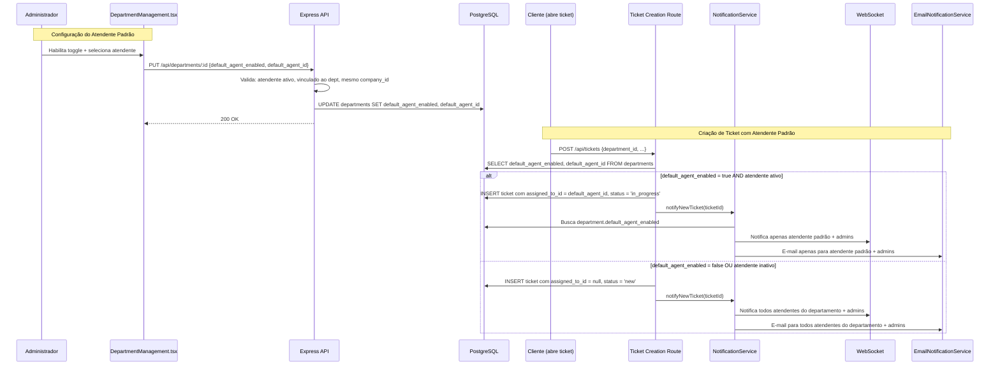
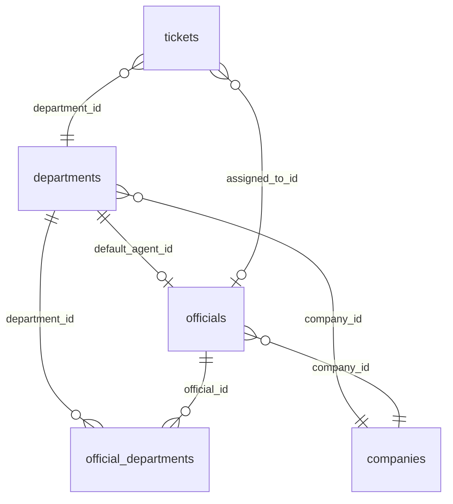

# Design — Atendente Padrão por Departamento

## Visão Geral

Esta funcionalidade adiciona a capacidade de configurar um atendente padrão por departamento. Quando habilitado, novos tickets criados naquele departamento são automaticamente atribuídos ao atendente padrão, e apenas ele (mais administradores) recebe a notificação — ao invés de notificar todos os atendentes do departamento.

A implementação envolve:
1. Migração de banco de dados para adicionar dois campos à tabela `departments`
2. Atualização do schema Drizzle ORM (`shared/schema.ts`)
3. Validação no backend (API de departamentos em `server/routes.ts`)
4. Lógica de atribuição automática na criação de tickets (`server/routes.ts` e `server/database-storage.ts`)
5. Alteração no serviço de notificação (`server/services/notification-service.ts`)
6. Formulário de departamento no frontend (`client/src/pages/DepartmentManagement.tsx`)
7. Chaves de internacionalização em `pt-BR.json` e `en-US.json`

## Arquitetura

O fluxo principal segue o padrão existente da aplicação: React → API REST (Express) → PostgreSQL (Drizzle ORM), com notificações via WebSocket + e-mail.



## Componentes e Interfaces

### 1. Migração de Banco de Dados

Arquivo: `db/migrations/094_add_default_agent_to_departments.sql`

```sql
ALTER TABLE departments
  ADD COLUMN default_agent_enabled BOOLEAN NOT NULL DEFAULT false,
  ADD COLUMN default_agent_id INTEGER DEFAULT NULL
    REFERENCES officials(id) ON DELETE SET NULL;
```

Decisão: `ON DELETE SET NULL` garante que se o atendente for removido, o campo é limpo automaticamente sem quebrar a integridade referencial. O `default_agent_enabled` permanece `true`, mas sem agente — a lógica de criação de ticket já trata esse cenário (fallback para fluxo normal).

### 2. Schema Drizzle ORM

Arquivo: `shared/schema.ts` — tabela `departments`

Adicionar dois campos ao final da definição existente:

```typescript
// Dentro de pgTable("departments", { ... })
default_agent_enabled: boolean("default_agent_enabled").default(false).notNull(),
default_agent_id: integer("default_agent_id").references(() => officials.id, { onDelete: 'set null' }),
```

### 3. API de Departamentos (Backend)

Arquivo: `server/routes.ts`

#### 3.1 Schema de Validação Zod

Atualizar `insertDepartmentSchemaInternal` para incluir os novos campos:

```typescript
const insertDepartmentSchemaInternal = z.object({
  // ... campos existentes ...
  default_agent_enabled: z.boolean().optional().default(false),
  default_agent_id: z.number().int().positive().nullable().optional().default(null),
}).refine((data) => {
  if (data.default_agent_enabled && !data.default_agent_id) {
    return false;
  }
  return true;
}, {
  message: "default_agent_id é obrigatório quando default_agent_enabled é true",
  path: ["default_agent_id"],
});
```

#### 3.2 Validação no PUT /api/departments/:id

Quando `default_agent_enabled` é `true`:
1. Verificar que `default_agent_id` é fornecido e não-nulo
2. Verificar que o atendente existe, está ativo (`is_active = true`), e pertence ao mesmo `company_id` do departamento
3. Verificar que o atendente está vinculado ao departamento via `official_departments`

Quando `default_agent_enabled` é `false`:
1. Definir `default_agent_id` como `null` automaticamente

#### 3.3 Endpoint para listar atendentes elegíveis

Reutilizar a query existente de atendentes por departamento. Não é necessário um endpoint novo — o frontend já busca atendentes vinculados ao departamento. Filtrar por `is_active = true` e `company_id` do departamento.

### 4. Lógica de Criação de Ticket

Arquivo: `server/routes.ts` — handler POST de tickets (linha ~4048)

Após criar o ticket, antes da análise de IA:

```typescript
// Verificar se o departamento tem atendente padrão
if (ticket.department_id) {
  const [dept] = await db.select()
    .from(departmentsSchema)
    .where(eq(departmentsSchema.id, ticket.department_id));

  if (dept?.default_agent_enabled && dept?.default_agent_id) {
    // Verificar se o atendente padrão está ativo
    const [agent] = await db.select()
      .from(schema.officials)
      .where(and(
        eq(schema.officials.id, dept.default_agent_id),
        eq(schema.officials.is_active, true)
      ));

    if (agent) {
      await storage.updateTicket(ticket.id, {
        assigned_to_id: dept.default_agent_id,
        status: 'in_progress',
      });
    } else {
      console.warn(`[Default Agent] Atendente padrão ${dept.default_agent_id} inativo. Seguindo fluxo normal.`);
    }
  }
}
```

### 5. Serviço de Notificação

Arquivo: `server/services/notification-service.ts` — método `notifyNewTicket`

Alterar o método para verificar se o departamento tem atendente padrão habilitado:

```typescript
public async notifyNewTicket(ticketId: number): Promise<void> {
  // ... buscar ticket existente ...

  // Notificar administradores (sempre)
  await this.sendNotificationToAdmins(payload, ticket.company_id);

  if (ticket.department_id) {
    // Verificar se o departamento tem atendente padrão
    const [dept] = await db.select()
      .from(departments)
      .where(eq(departments.id, ticket.department_id));

    if (dept?.default_agent_enabled && dept?.default_agent_id) {
      // Buscar user_id do atendente padrão
      const [agent] = await db.select()
        .from(officials)
        .where(and(
          eq(officials.id, dept.default_agent_id),
          eq(officials.is_active, true)
        ));

      if (agent?.user_id) {
        await this.sendNotificationToUser(agent.user_id, payload);
      } else {
        // Fallback: atendente inativo, notificar departamento inteiro
        await this.sendNotificationToDepartment(ticket.department_id, payload, ticket.company_id);
      }
    } else {
      // Fluxo normal: notificar departamento inteiro
      await this.sendNotificationToDepartment(ticket.department_id, payload, ticket.company_id);
    }
  } else {
    await this.sendNotificationToSupport(payload, ticket.company_id);
  }
}
```

A mesma lógica se aplica ao `emailNotificationService.notifyNewTicket`.

### 6. Frontend — Formulário de Departamento

Arquivo: `client/src/pages/DepartmentManagement.tsx`

#### 6.1 Interface DepartmentFormData

Adicionar:
```typescript
interface DepartmentFormData {
  // ... campos existentes ...
  default_agent_enabled?: boolean;
  default_agent_id?: number | null;
}
```

#### 6.2 Componentes no formulário

Dentro do `Dialog` de criação/edição de departamento, adicionar após os toggles existentes:

1. `Switch` para `default_agent_enabled` com label i18n
2. `Select` dropdown (condicional, visível apenas quando toggle está ativo) listando atendentes ativos vinculados ao departamento
3. Validação: se toggle ativo e nenhum atendente selecionado, exibir mensagem de erro

#### 6.3 Query de atendentes por departamento

```typescript
const { data: departmentOfficials = [] } = useQuery({
  queryKey: ['/api/officials', currentDepartment.id, 'department-agents'],
  queryFn: async () => {
    // Buscar atendentes ativos vinculados ao departamento
    const response = await apiRequest('GET', `/api/officials?department_id=${currentDepartment.id}&active_only=true`);
    return response.json();
  },
  enabled: !!currentDepartment.id && currentDepartment.default_agent_enabled === true,
});
```

### 7. Internacionalização

Arquivos: `client/src/i18n/messages/pt-BR.json` e `en-US.json`

Chaves a adicionar:

```json
{
  "departments": {
    "default_agent_enabled": "Atendente padrão",
    "default_agent_enabled_description": "Quando habilitado, novos chamados serão automaticamente atribuídos ao atendente selecionado",
    "default_agent_id": "Selecionar atendente padrão",
    "default_agent_id_placeholder": "Selecione um atendente",
    "default_agent_validation_required": "Selecione um atendente padrão quando a funcionalidade está habilitada",
    "default_agent_not_found": "Atendente padrão não encontrado ou inativo"
  }
}
```

## Modelos de Dados

### Tabela `departments` (alteração)

| Campo | Tipo | Default | Descrição |
|---|---|---|---|
| `default_agent_enabled` | `BOOLEAN NOT NULL` | `false` | Habilita/desabilita atendente padrão |
| `default_agent_id` | `INTEGER NULL` | `null` | FK → `officials.id`, ON DELETE SET NULL |

### Invariantes de dados

1. Se `default_agent_enabled = false`, então `default_agent_id` DEVE ser `null`
2. Se `default_agent_enabled = true`, então `default_agent_id` DEVE referenciar um atendente ativo vinculado ao departamento e com o mesmo `company_id`
3. O `default_agent_id` DEVE pertencer à mesma empresa (`company_id`) do departamento (isolamento multi-tenant)

### Relacionamentos




## Propriedades de Corretude

*Uma propriedade é uma característica ou comportamento que deve ser verdadeiro em todas as execuções válidas de um sistema — essencialmente, uma declaração formal sobre o que o sistema deve fazer. Propriedades servem como ponte entre especificações legíveis por humanos e garantias de corretude verificáveis por máquina.*

### Propriedade 1: Defaults do schema para novos departamentos

*Para qualquer* departamento criado sem especificar `default_agent_enabled` ou `default_agent_id`, o campo `default_agent_enabled` deve ser `false` e o campo `default_agent_id` deve ser `null`.

**Valida: Requisitos 1.1, 1.2**

### Propriedade 2: Validação da API rejeita configurações inválidas de atendente padrão

*Para qualquer* requisição de atualização de departamento onde `default_agent_enabled` é `true`, se o `default_agent_id` é nulo, referencia um atendente inexistente, inativo, não vinculado ao departamento, ou de outra empresa (`company_id` diferente), a API deve retornar erro HTTP 400.

**Valida: Requisitos 1.6, 1.7, 4.2**

### Propriedade 3: Desabilitar atendente padrão limpa o agent_id

*Para qualquer* departamento que possui `default_agent_enabled = true` e um `default_agent_id` válido, ao atualizar `default_agent_enabled` para `false`, o campo `default_agent_id` resultante deve ser `null`.

**Valida: Requisitos 1.8**

### Propriedade 4: Atribuição automática de ticket com atendente padrão

*Para qualquer* ticket criado em um departamento com `default_agent_enabled = true` e um atendente padrão ativo, o ticket resultante deve ter `assigned_to_id` igual ao `default_agent_id` do departamento e `status` igual a `in_progress`. Inversamente, para qualquer ticket criado em um departamento com `default_agent_enabled = false`, o `assigned_to_id` deve ser `null` e o `status` deve ser `new`.

**Valida: Requisitos 2.1, 2.2, 2.3**

### Propriedade 5: Roteamento de notificação com atendente padrão

*Para qualquer* ticket criado em um departamento com `default_agent_enabled = true` e atendente padrão ativo, o conjunto de usuários notificados deve conter apenas o `user_id` do atendente padrão e os administradores da empresa — excluindo os demais atendentes do departamento. Para departamentos sem atendente padrão, todos os atendentes do departamento devem ser notificados.

**Valida: Requisitos 3.1, 3.2, 3.3**

### Propriedade 6: Isolamento multi-tenant na listagem de atendentes elegíveis

*Para qualquer* consulta de atendentes elegíveis para atendente padrão de um departamento, todos os atendentes retornados devem ter o mesmo `company_id` do departamento.

**Valida: Requisitos 4.1**

## Tratamento de Erros

| Cenário | Comportamento | HTTP Status |
|---|---|---|
| `default_agent_enabled=true` sem `default_agent_id` | Retorna erro de validação | 400 |
| `default_agent_id` referencia atendente inexistente | Retorna erro de validação | 400 |
| `default_agent_id` referencia atendente inativo | Retorna erro de validação | 400 |
| `default_agent_id` referencia atendente de outra empresa | Retorna erro de validação | 400 |
| `default_agent_id` referencia atendente não vinculado ao departamento | Retorna erro de validação | 400 |
| Atendente padrão inativo no momento da criação do ticket | Fallback para fluxo normal (ticket sem atendente, status `new`), log de aviso | N/A (interno) |
| Atendente padrão removido do banco (FK ON DELETE SET NULL) | `default_agent_id` vira `null` automaticamente, fluxo normal na próxima criação de ticket | N/A (automático) |
| Falha na notificação ao atendente padrão | Log de erro, não impede criação do ticket (fire-and-forget, padrão existente) | N/A |

## Estratégia de Testes

### Testes Unitários

Testes unitários devem cobrir exemplos específicos e edge cases:

- Criação de departamento com defaults corretos (sem especificar campos de atendente padrão)
- Toggle do formulário mostra/oculta dropdown (UI)
- Validação do formulário quando toggle ativo sem atendente selecionado (UI)
- Edge case: atendente padrão inativo no momento da criação do ticket → fallback
- Edge case: atendente padrão removido (ON DELETE SET NULL) → campo null
- Super admin pode configurar atendente padrão para qualquer empresa
- Chaves i18n existem em ambos os arquivos (pt-BR e en-US)

### Testes de Propriedade (Property-Based Testing)

Biblioteca: `fast-check` (já compatível com Vitest)

Cada propriedade de corretude deve ser implementada como um único teste de propriedade com mínimo de 100 iterações.

- **Feature: default-agent-assignment, Property 1: Defaults do schema** — Gerar departamentos aleatórios sem campos de atendente padrão, verificar defaults
- **Feature: default-agent-assignment, Property 2: Validação da API** — Gerar combinações aleatórias de (department, agent_id, enabled) incluindo agentes inválidos/inativos/de outra empresa, verificar que a API rejeita corretamente
- **Feature: default-agent-assignment, Property 3: Desabilitar limpa agent_id** — Gerar departamentos com atendente padrão habilitado, desabilitar, verificar que agent_id é null
- **Feature: default-agent-assignment, Property 4: Atribuição automática** — Gerar tickets em departamentos com/sem atendente padrão, verificar assigned_to_id e status
- **Feature: default-agent-assignment, Property 5: Roteamento de notificação** — Gerar tickets em departamentos com/sem atendente padrão, verificar conjunto de usuários notificados
- **Feature: default-agent-assignment, Property 6: Isolamento multi-tenant** — Gerar departamentos e atendentes de empresas diferentes, verificar que a listagem filtra corretamente

Configuração:
```typescript
import fc from 'fast-check';

// Mínimo 100 iterações por propriedade
const PBT_CONFIG = { numRuns: 100 };
```
