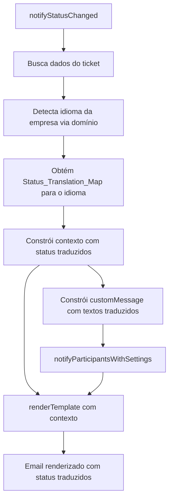

# Design Document: Correção de Variáveis de Template de Email

## Overview

Este design aborda a correção de variáveis de template de email no sistema GestaoTickets, onde valores brutos de enum de status (ex: `waiting_customer`) são exibidos nos emails ao invés de textos traduzidos (ex: "Aguardando Cliente"). A solução centraliza o mapeamento de tradução de status, garante cobertura completa de todos os status do sistema, e adiciona suporte bilíngue (pt-BR/en-US) baseado no domínio da empresa.

## Arquitetura

A correção segue a arquitetura existente do `EmailNotificationService`, com as seguintes mudanças:

1. Extrair o `Status_Translation_Map` para um módulo compartilhado, eliminando duplicação entre `translateStatus()` e `notifyStatusChanged()`
2. Adicionar detecção de idioma baseada no domínio da empresa no fluxo de renderização de templates
3. Corrigir os seed templates para usar variáveis `_text` consistentemente



## Componentes e Interfaces

### 1. Módulo de Tradução de Status (`server/utils/status-translations.ts`)

Novo módulo que centraliza todas as traduções de status:

```typescript
export interface StatusTranslationMaps {
  'pt-BR': Record<string, string>;
  'en-US': Record<string, string>;
}

export const STATUS_TRANSLATIONS: StatusTranslationMaps = {
  'pt-BR': {
    'new': 'Novo',
    'ongoing': 'Em Andamento',
    'suspended': 'Suspenso',
    'waiting_customer': 'Aguardando Cliente',
    'escalated': 'Escalado',
    'in_analysis': 'Em Análise',
    'pending_deployment': 'Aguardando Deploy',
    'reopened': 'Reaberto',
    'resolved': 'Resolvido',
    'closed': 'Encerrado',
    'undefined': 'Não Definido',
    'null': 'Não Definido',
    '': 'Não Definido'
  },
  'en-US': {
    'new': 'New',
    'ongoing': 'In Progress',
    'suspended': 'Suspended',
    'waiting_customer': 'Waiting for Customer',
    'escalated': 'Escalated',
    'in_analysis': 'In Analysis',
    'pending_deployment': 'Pending Deployment',
    'reopened': 'Reopened',
    'resolved': 'Resolved',
    'closed': 'Closed',
    'undefined': 'Not Defined',
    'null': 'Not Defined',
    '': 'Not Defined'
  }
};

export function translateStatus(status: string, language: 'pt-BR' | 'en-US' = 'pt-BR'): string {
  return STATUS_TRANSLATIONS[language][status] || status;
}

export function translatePriority(priority: string, language: 'pt-BR' | 'en-US' = 'pt-BR'): string {
  // Mapas de prioridade por idioma
}

export function translateRole(role: string, language: 'pt-BR' | 'en-US' = 'pt-BR'): string {
  // Mapas de role por idioma
}

export function detectLanguageFromDomain(domain: string | null | undefined): 'pt-BR' | 'en-US' {
  if (domain && domain.includes('vixpaulahermanny.com')) {
    return 'en-US';
  }
  return 'pt-BR';
}
```

### 2. Alterações no `EmailNotificationService`

- `renderTemplate()`: Substituir as funções locais `translateStatus`, `translatePriority`, `translateRole` por chamadas ao módulo centralizado, passando o idioma detectado
- `notifyStatusChanged()`: Remover o `statusTranslations` local e usar o módulo centralizado; garantir que `customMessage` use textos traduzidos
- Adicionar detecção de idioma via domínio da empresa em métodos que constroem contexto

### 3. Correção dos Seed Templates

Atualizar a rota `seed-defaults` para garantir que todos os templates usem variáveis `_text`:
- `{{ticket.status}}` → `{{ticket.status_text}}`
- `{{status_change.old_status}}` → `{{status_change.old_status_text}}`
- `{{status_change.new_status}}` → `{{status_change.new_status_text}}`

## Data Models

### Status_Translation_Map

```typescript
type SupportedLanguage = 'pt-BR' | 'en-US';

type StatusTranslationMaps = {
  [lang in SupportedLanguage]: Record<string, string>;
};
```

### EmailNotificationContext (sem alteração na interface)

A interface `EmailNotificationContext` existente já suporta os campos necessários. A mudança é garantir que os valores passados nos campos `status_change.old_status` e `status_change.new_status` sejam sempre textos traduzidos quando usados em contextos voltados ao usuário.


## Correctness Properties

*Uma propriedade é uma característica ou comportamento que deve ser verdadeiro em todas as execuções válidas de um sistema — essencialmente, uma declaração formal sobre o que o sistema deve fazer. Propriedades servem como ponte entre especificações legíveis por humanos e garantias de corretude verificáveis por máquina.*

### Property 1: Tradução de status cobre todos os enums válidos

*Para qualquer* Status_Enum válido do sistema (`new`, `ongoing`, `suspended`, `waiting_customer`, `escalated`, `in_analysis`, `pending_deployment`, `reopened`, `resolved`, `closed`) e *para qualquer* placeholder `_text` (`ticket.status_text`, `status_change.old_status_text`, `status_change.new_status_text`), ao renderizar um template contendo esse placeholder, o resultado deve conter o Status_Text correspondente do mapa de tradução e nunca o valor bruto do enum.

**Validates: Requirements 1.1, 1.2, 1.3**

### Property 2: Fallback para status desconhecido

*Para qualquer* string que não esteja presente no Status_Translation_Map, a função `translateStatus()` deve retornar a string original inalterada.

**Validates: Requirements 1.4**

### Property 3: Custom_Message contém apenas textos traduzidos

*Para qualquer* par de Status_Enum (oldStatus, newStatus) válidos, a Custom_Message construída para notificação de participantes deve conter os Status_Text correspondentes e não deve conter nenhum dos valores brutos de enum.

**Validates: Requirements 2.1**

### Property 4: Seed templates usam variáveis _text

*Para qualquer* seed template do sistema, o conteúdo (html_template, text_template, subject_template) não deve conter `{{ticket.status}}`, `{{status_change.old_status}}` ou `{{status_change.new_status}}` sem o sufixo `_text`, e não deve conter placeholders com espaços internos (ex: `{{ ticket.`).

**Validates: Requirements 3.1, 3.2, 3.3, 3.4**

### Property 5: Tradução por idioma retorna valor correto do mapa

*Para qualquer* Status_Enum válido e *para qualquer* idioma suportado (`pt-BR`, `en-US`), a função `translateStatus(status, language)` deve retornar exatamente o valor correspondente no mapa de tradução daquele idioma.

**Validates: Requirements 5.1, 5.2**

## Error Handling

1. **Status desconhecido**: Quando um Status_Enum não está no mapa de tradução, retornar o valor original como fallback (nunca lançar exceção)
2. **Domínio nulo/indefinido**: Quando a empresa não tem domínio definido, usar `pt-BR` como idioma padrão
3. **Template com placeholders inválidos**: O `renderTemplate` já trata placeholders não reconhecidos deixando-os como estão; esse comportamento é mantido
4. **Contexto incompleto**: Se `status_change` for `undefined` no contexto, os placeholders de mudança de status permanecem sem substituição (comportamento existente mantido)

## Testing Strategy

### Abordagem Dual: Testes Unitários + Testes de Propriedade

**Testes Unitários** (exemplos específicos e edge cases):
- Verificar tradução de cada status individual em pt-BR e en-US
- Verificar fallback para status desconhecido
- Verificar detecção de idioma para domínios conhecidos (vixpaulahermanny.com → en-US)
- Verificar detecção de idioma para domínio null/undefined → pt-BR
- Verificar que `renderTemplate` substitui corretamente `{{ticket.status_text}}`
- Verificar que a customMessage em `notifyStatusChanged` usa textos traduzidos

**Testes de Propriedade** (propriedades universais):
- Biblioteca: `fast-check` (TypeScript)
- Mínimo 100 iterações por teste
- Cada teste referencia a propriedade do design

**Configuração de Tags**:
- Feature: email-template-variables-fixes, Property 1: Tradução de status cobre todos os enums válidos
- Feature: email-template-variables-fixes, Property 2: Fallback para status desconhecido
- Feature: email-template-variables-fixes, Property 3: Custom_Message contém apenas textos traduzidos
- Feature: email-template-variables-fixes, Property 4: Seed templates usam variáveis _text
- Feature: email-template-variables-fixes, Property 5: Tradução por idioma retorna valor correto do mapa
