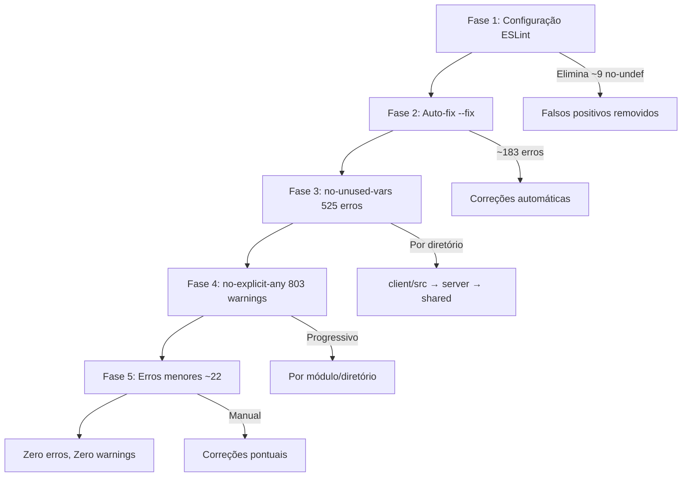

# Documento de Design: Correção de Erros de Lint

## Visão Geral

Este design descreve a abordagem técnica para corrigir 1577 problemas de lint no projeto, organizados em 5 fases incrementais. A estratégia prioriza correções de configuração primeiro (eliminando falsos positivos), depois correções automáticas, seguidas de correções manuais organizadas por severidade e volume.

A abordagem é conservadora: cada fase é validada antes de prosseguir, garantindo que nenhuma correção introduza regressões.

## Arquitetura

A correção segue uma pipeline de 5 fases sequenciais:



## Componentes e Interfaces

### Componente 1: ESLint Config Reestruturado (`eslint.config.js`)

A configuração será reestruturada para suportar múltiplos ambientes com regras específicas por diretório.

**Estrutura proposta:**

```js
import eslint from '@eslint/js';
import tseslint from 'typescript-eslint';
import reactHooksPlugin from 'eslint-plugin-react-hooks';
import globals from 'globals';

export default tseslint.config(
  // Config base
  eslint.configs.recommended,
  ...tseslint.configs.recommended,

  // Config global de regras
  {
    rules: {
      '@typescript-eslint/no-explicit-any': 'error',
      '@typescript-eslint/no-unused-vars': ['error', {
        argsIgnorePattern: '^_',
        varsIgnorePattern: '^_',
        caughtErrorsIgnorePattern: '^_',
      }],
    },
  },

  // Config para client (browser)
  {
    files: ['client/src/**/*.{ts,tsx}'],
    languageOptions: {
      globals: {
        ...globals.browser,
      },
    },
    plugins: {
      'react-hooks': reactHooksPlugin,
    },
    rules: {
      ...reactHooksPlugin.configs.recommended.rules,
    },
  },

  // Config para server (Node.js)
  {
    files: ['server/**/*.{ts,tsx}'],
    languageOptions: {
      globals: {
        ...globals.node,
      },
    },
  },

  // Config para shared
  {
    files: ['shared/**/*.{ts,tsx}'],
    languageOptions: {
      globals: {
        ...globals.node,
      },
    },
  },

  // Ignores
  {
    ignores: [
      'dist/**',
      'node_modules/**',
      'build/**',
      '*.config.js',
      '*.config.ts',
      'scripts/**',
    ],
  }
);
```

**Dependências necessárias:**
- `globals` (pacote npm) — fornece definições de globals para browser e node
- `eslint-plugin-react-hooks` — plugin oficial do React para regras de hooks

### Componente 2: Estratégia de Correção de `no-unused-vars` (525 erros)

Organizado por diretório para facilitar execução incremental:

| Diretório | Ação Principal |
|---|---|
| `client/src/` | Remover imports não utilizados, remover variáveis de estado não usadas, prefixar callbacks com `_` |
| `server/` | Remover imports não utilizados, prefixar parâmetros de middleware com `_` (ex: `_req`, `_res`, `_next`) |
| `shared/` | Remover imports e variáveis não utilizadas |

**Padrões de correção:**

```typescript
// ANTES: import não utilizado
import { useState, useEffect, useCallback } from 'react';
// Se useCallback não é usado:
// DEPOIS:
import { useState, useEffect } from 'react';

// ANTES: parâmetro de middleware não utilizado
app.get('/api/data', (req, res, next) => { ... });
// Se next não é usado:
// DEPOIS:
app.get('/api/data', (req, res, _next) => { ... });
// Ou se req não é usado:
app.get('/api/data', (_req, res) => { ... });

// ANTES: variável de desestruturação não utilizada
const { data, error, isLoading } = useQuery(...);
// Se error não é usado:
// DEPOIS:
const { data, isLoading } = useQuery(...);
```

### Componente 3: Estratégia de Tipagem para `no-explicit-any` (803 warnings)

Abordagem progressiva por módulo, priorizando arquivos com menos ocorrências primeiro:

**Categorias de substituição de `any`:**

| Categoria | Exemplo | Substituição |
|---|---|---|
| Event handlers | `(e: any)` | `(e: React.ChangeEvent<HTMLInputElement>)` |
| API responses | `data: any` | `data: ApiResponseType` |
| Parâmetros de função | `(param: any)` | `(param: SpecificType)` |
| Estado genérico | `useState<any>()` | `useState<SpecificType>()` |
| Catch errors | `catch (e: any)` | `catch (e: unknown)` |
| Tipos complexos | `Record<string, any>` | `Record<string, SpecificType>` ou tipo dedicado |

**Ordem de execução por diretório:**

1. `shared/` — menor volume, tipos compartilhados que beneficiam todo o projeto
2. `server/types/` — definições de tipos do servidor
3. `server/` — restante do servidor
4. `client/src/lib/` e `client/src/utils/` — utilitários do client
5. `client/src/hooks/` — hooks customizados
6. `client/src/components/` — componentes React
7. `client/src/pages/` — páginas

**Para casos onde a tipagem é complexa demais:**

```typescript
// Permitido com justificativa:
// eslint-disable-next-line @typescript-eslint/no-explicit-any -- API externa sem tipos disponíveis
const response: any = await externalApi.call();
```

### Componente 4: Correção de Erros Menores (~22 erros)

| Regra | Qtd | Estratégia de Correção |
|---|---|---|
| `no-useless-assignment` (8) | Remover atribuições sem efeito |
| `ban-ts-comment` (7) | Substituir `@ts-ignore` por `@ts-expect-error` com justificativa |
| `no-empty` (4) | Adicionar comentário `// intentionally empty` ou lógica |
| `no-empty-object-type` (3) | Substituir `{}` por `Record<string, never>` ou tipo específico |
| `no-unused-expressions` (3) | Converter para statements válidos ou remover |
| `no-useless-catch` (2) | Remover try/catch desnecessário ou adicionar lógica ao catch |
| `no-non-null-asserted-optional-chain` (2) | Remover `!` após `?.` e tratar o caso null |
| `no-require-imports` (2) | Converter `require()` para `import` |
| `react-hooks/exhaustive-deps` (1) | Adicionar dependências faltantes ao array |
| `no-self-assign` (1) | Remover auto-atribuição |
| `no-case-declarations` (1) | Envolver case em bloco `{}` |
| `no-namespace` (1) | Converter namespace para module ou desabilitar pontualmente |
| `no-useless-escape` (1) | Remover escape desnecessário |

## Modelos de Dados

Não se aplica — esta feature não altera modelos de dados. As alterações são exclusivamente em configuração de ferramentas e correções de código estático.


## Propriedades de Corretude

*Uma propriedade é uma característica ou comportamento que deve ser verdadeiro em todas as execuções válidas de um sistema — essencialmente, uma declaração formal sobre o que o sistema deve fazer. Propriedades servem como ponte entre especificações legíveis por humanos e garantias de corretude verificáveis por máquina.*

### Análise de Testabilidade

Esta feature trata de correção de configuração de ferramentas e limpeza de código estático. Todos os critérios de aceitação são verificáveis como exemplos concretos (rodar lint e checar output), não como propriedades universais aplicáveis a property-based testing.

As verificações são:
- Rodar `npm run lint` e confirmar zero erros/warnings (critério final 6.1)
- Verificar contagens intermediárias por regra e diretório (checkpoints)
- Confirmar que a configuração do ESLint carrega sem erros

Não há propriedades universais quantificadas ("para todo X...") aplicáveis, pois não estamos testando lógica de negócio, mas sim configuração de ferramentas e conformidade de código estático.

**Nenhuma propriedade de corretude baseada em property-based testing é aplicável a esta feature.**

## Tratamento de Erros

### Riscos e Mitigações

| Risco | Mitigação |
|---|---|
| Auto-fix altera comportamento do código | Rodar testes existentes após cada fase |
| Remoção de import quebra funcionalidade | Verificar que o import realmente não é usado (não é re-exportado) |
| Tipagem incorreta substitui `any` | Usar tipos das bibliotecas (@types/*) e interfaces existentes do projeto |
| Plugin de React Hooks incompatível | Verificar compatibilidade com ESLint 10 e React 19 antes de instalar |
| Novo erro introduzido durante correção | Rodar lint após cada batch de correções |

### Estratégia de Rollback

Cada fase é um commit separado. Se uma fase introduzir problemas:
1. Reverter o commit da fase
2. Investigar o problema
3. Corrigir e re-aplicar

## Estratégia de Testes

### Verificação por Fase

A validação desta feature é feita exclusivamente por execução do lint e testes existentes:

| Fase | Verificação |
|---|---|
| Fase 1 (Config) | `npm run lint` — erros de `no-undef` devem desaparecer |
| Fase 2 (Auto-fix) | `npm run lint` — contagem de erros deve reduzir em ~183 |
| Fase 3 (unused-vars) | `npm run lint` — zero erros de `no-unused-vars` |
| Fase 4 (any) | `npm run lint` — zero warnings de `no-explicit-any` |
| Fase 5 (menores) | `npm run lint` — zero erros e zero warnings total |

### Testes de Regressão

Após cada fase, os testes existentes do projeto (`npm run test`) devem continuar passando, garantindo que as correções de lint não alteraram o comportamento funcional.

### Property-Based Testing

Não aplicável a esta feature. As correções são de configuração e código estático, sem lógica de negócio testável por properties.
