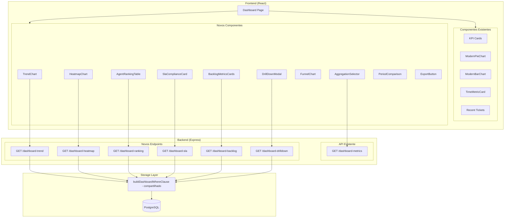
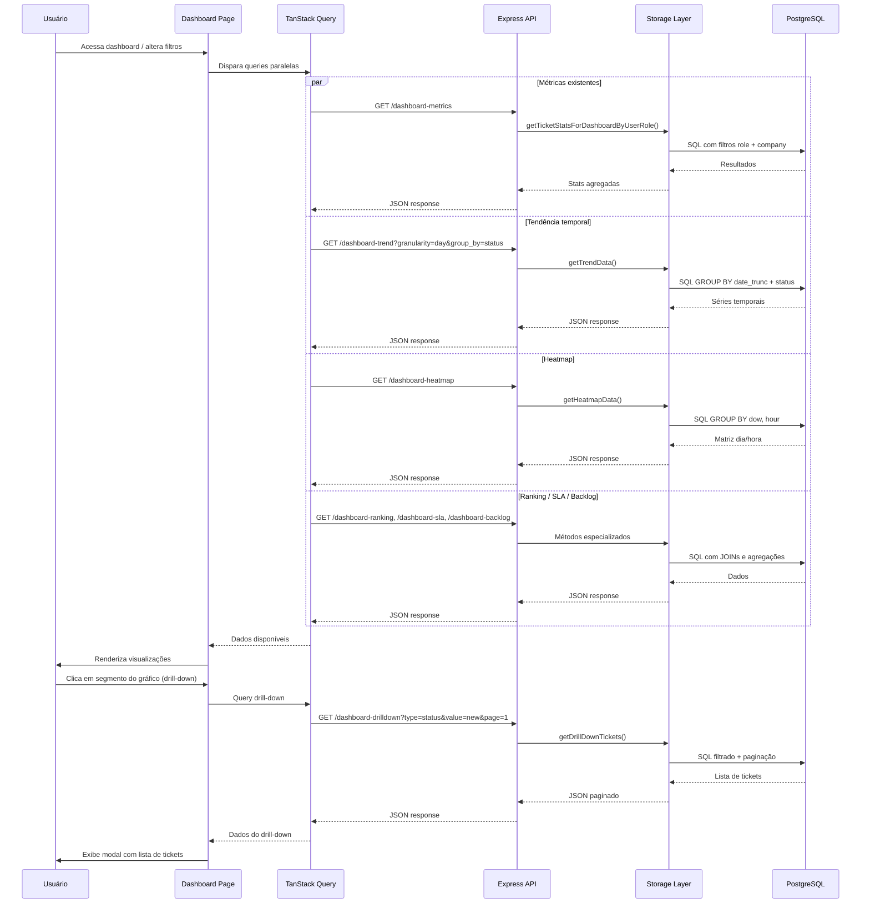

# Design — Dashboard Interativo BI

## Visão Geral

Esta feature transforma o dashboard existente (`client/src/pages/dashboard.tsx`) em um painel interativo estilo BI, adicionando novas visualizações e funcionalidades analíticas. O design se baseia na arquitetura atual — um endpoint único `GET /api/tickets/dashboard-metrics` que busca tickets filtrados por role/company e calcula estatísticas em memória — e a estende com novos endpoints especializados e componentes React reutilizáveis.

A abordagem é incremental: os componentes e KPIs existentes permanecem intactos, e as novas visualizações são adicionadas como seções adicionais no layout do dashboard. Todas as novas funcionalidades respeitam multi-tenancy (`company_id`), controle de acesso por role, e internacionalização (pt-BR / en-US).

### Decisões de Design Principais

1. **Novos endpoints especializados** ao invés de sobrecarregar o endpoint existente — cada visualização complexa (heatmap, tendência, ranking, backlog) terá seu próprio endpoint para manter a separação de responsabilidades e permitir carregamento paralelo.
2. **Cálculos no banco (SQL)** para agregações pesadas (heatmap, tendência, ranking) ao invés de buscar todos os tickets e calcular em memória, garantindo performance com volumes grandes.
3. **Componentes React isolados** para cada nova visualização, seguindo o padrão existente de `ModernPieChart` e `ModernBarChart`.
4. **Reutilização da lógica de filtros por role** já implementada em `getTicketsForDashboardByUserRole`, extraindo as cláusulas WHERE em uma função compartilhada.
5. **Exportação client-side** usando bibliotecas como `xlsx` para gerar CSV/Excel no navegador, evitando carga adicional no servidor.

## Arquitetura

### Diagrama de Arquitetura



### Fluxo de Dados




## Componentes e Interfaces

### Novos Endpoints da API

#### 1. `GET /api/tickets/dashboard-trend`

Retorna dados de tendência temporal para o line chart.

**Query Parameters:**
- `start_date`, `end_date` — período
- `granularity` — `day` | `week` | `month`
- `group_by` — `status` | `priority` (opcional, padrão: nenhum — linha única de total)
- `official_id`, `department_id`, `incident_type_id`, `category_id` — filtros existentes

**Response:**
```json
{
  "series": [
    {
      "name": "new",
      "data": [
        { "date": "2025-01-01", "count": 12 },
        { "date": "2025-01-02", "count": 8 }
      ]
    },
    {
      "name": "ongoing",
      "data": [
        { "date": "2025-01-01", "count": 5 },
        { "date": "2025-01-02", "count": 10 }
      ]
    }
  ]
}
```

#### 2. `GET /api/tickets/dashboard-heatmap`

Retorna dados de volume por dia da semana e hora.

**Query Parameters:** mesmos filtros existentes + `start_date`, `end_date`

**Response:**
```json
{
  "data": [
    { "day_of_week": 0, "hour": 9, "count": 15 },
    { "day_of_week": 0, "hour": 10, "count": 22 },
    { "day_of_week": 1, "hour": 9, "count": 18 }
  ]
}
```
> `day_of_week`: 0 = domingo, 1 = segunda, ..., 6 = sábado (padrão PostgreSQL `EXTRACT(DOW)`)

#### 3. `GET /api/tickets/dashboard-ranking`

Retorna ranking de atendentes.

**Query Parameters:** mesmos filtros existentes + `start_date`, `end_date` + `sort_by` (`resolved_count` | `avg_first_response` | `avg_resolution`)

**Response:**
```json
{
  "ranking": [
    {
      "official_id": 1,
      "official_name": "João Silva",
      "resolved_count": 45,
      "avg_first_response_hours": 2.5,
      "avg_resolution_hours": 18.3
    }
  ]
}
```

#### 4. `GET /api/tickets/dashboard-sla`

Retorna taxa de conformidade SLA.

**Query Parameters:** mesmos filtros existentes + `start_date`, `end_date`

**Response:**
```json
{
  "total_resolved": 100,
  "within_sla": 85,
  "compliance_rate": 85.0,
  "has_sla_config": true
}
```

#### 5. `GET /api/tickets/dashboard-backlog`

Retorna métricas de backlog.

**Query Parameters:** `department_id`, `official_id` (filtros aplicáveis)

**Response:**
```json
{
  "open_over_7_days": 12,
  "unassigned": 8,
  "stale_over_3_days": 5
}
```

#### 6. `GET /api/tickets/dashboard-drilldown`

Retorna lista paginada de tickets para drill-down.

**Query Parameters:**
- `type` — `status` | `priority` | `department` | `official` | `incident_type` | `category` | `backlog_type`
- `value` — valor do segmento clicado (ex: `new`, `high`, `open_over_7_days`)
- `page`, `page_size` (padrão: 1, 20)
- Mesmos filtros existentes + `start_date`, `end_date`

**Response:**
```json
{
  "tickets": [
    {
      "id": 123,
      "ticket_id": "TK-00123",
      "title": "Problema no login",
      "status": "new",
      "priority": "high",
      "created_at": "2025-01-15T10:30:00Z",
      "official_name": "Maria Santos"
    }
  ],
  "total": 45,
  "page": 1,
  "page_size": 20
}
```

### Novos Componentes React

#### 1. `TrendChart` (`client/src/components/charts/trend-chart.tsx`)

Line chart com recharts mostrando evolução temporal. Aceita props para granularidade e agrupamento.

```typescript
interface TrendChartProps {
  data: TrendSeries[];
  isLoading: boolean;
  granularity: 'day' | 'week' | 'month';
  onGranularityChange: (g: 'day' | 'week' | 'month') => void;
  groupBy: 'none' | 'status' | 'priority';
  onGroupByChange: (g: 'none' | 'status' | 'priority') => void;
}
```

#### 2. `HeatmapChart` (`client/src/components/charts/heatmap-chart.tsx`)

Grid customizado com recharts (ou SVG puro) representando volume por dia/hora com escala de cores.

```typescript
interface HeatmapChartProps {
  data: HeatmapCell[];
  isLoading: boolean;
}
```

#### 3. `AgentRankingTable` (`client/src/components/charts/agent-ranking-table.tsx`)

Tabela com ordenação alternável mostrando performance dos atendentes.

```typescript
interface AgentRankingTableProps {
  data: AgentRankingEntry[];
  isLoading: boolean;
  sortBy: 'resolved_count' | 'avg_first_response' | 'avg_resolution';
  onSortChange: (sort: string) => void;
}
```

#### 4. `SlaComplianceCard` (`client/src/components/charts/sla-compliance-card.tsx`)

Card com gauge/indicador visual da taxa de conformidade SLA.

```typescript
interface SlaComplianceCardProps {
  complianceRate: number;
  totalResolved: number;
  withinSla: number;
  hasSlaConfig: boolean;
  isLoading: boolean;
}
```

#### 5. `AggregationSelector` (`client/src/components/charts/aggregation-selector.tsx`)

Seletor de critério de agrupamento para os gráficos de pizza e barras existentes.

```typescript
interface AggregationSelectorProps {
  value: AggregationType;
  onChange: (value: AggregationType) => void;
  isCustomer: boolean;
}

type AggregationType = 'status' | 'priority' | 'department' | 'official' | 'incident_type' | 'category';
```

#### 6. `DrillDownModal` (`client/src/components/charts/drill-down-modal.tsx`)

Modal/sheet com lista paginada de tickets, com link para detalhes.

```typescript
interface DrillDownModalProps {
  open: boolean;
  onClose: () => void;
  type: string;
  value: string;
  title: string;
  filters: DashboardFilters;
}
```

#### 7. `FunnelChart` (`client/src/components/charts/funnel-chart.tsx`)

Gráfico de funil mostrando fluxo entre status com taxas de conversão.

```typescript
interface FunnelChartProps {
  data: { status: string; count: number }[];
  isLoading: boolean;
}
```

#### 8. `BacklogMetricsCards` (`client/src/components/charts/backlog-metrics-cards.tsx`)

Cards com indicadores de backlog, clicáveis para drill-down.

```typescript
interface BacklogMetricsCardsProps {
  openOver7Days: number;
  unassigned: number;
  staleOver3Days: number;
  isLoading: boolean;
  onCardClick: (backlogType: string) => void;
}
```

#### 9. `PeriodComparison` (`client/src/components/charts/period-comparison.tsx`)

Seção comparativa lado a lado entre período atual e anterior, reutilizando `ComparisonArrow`.

```typescript
interface PeriodComparisonProps {
  current: PeriodMetrics;
  previous: PeriodMetrics | null;
  isLoading: boolean;
}
```

#### 10. `ExportButton` (`client/src/components/charts/export-button.tsx`)

Botão com dropdown para exportar dados em CSV ou XLSX.

```typescript
interface ExportButtonProps {
  dashboardData: DashboardExportData;
  filters: DashboardFilters;
  locale: string;
}
```

### Função Compartilhada de Filtros (Storage Layer)

Para evitar duplicação da lógica de filtros por role, será extraída uma função:

```typescript
// server/database-storage.ts
async buildDashboardWhereClause(
  userId: number,
  userRole: string,
  options?: {
    officialId?: number;
    startDate?: Date;
    endDate?: Date;
    departmentId?: number;
    incidentTypeId?: number;
    categoryId?: number;
    dateField?: 'created_at' | 'resolved_at'; // para flexibilidade
  }
): Promise<SQL[]>
```

Esta função retorna as cláusulas WHERE que podem ser usadas em qualquer query do dashboard, garantindo consistência de segurança entre todos os endpoints.


## Modelos de Dados

### Tipos TypeScript Compartilhados

```typescript
// shared/types/dashboard.ts

/** Série temporal para o gráfico de tendência */
export interface TrendSeries {
  name: string; // ex: "new", "ongoing", "total"
  data: { date: string; count: number }[];
}

/** Célula do heatmap (dia da semana x hora) */
export interface HeatmapCell {
  day_of_week: number; // 0=dom, 1=seg, ..., 6=sáb
  hour: number;        // 0-23
  count: number;
}

/** Entrada do ranking de atendentes */
export interface AgentRankingEntry {
  official_id: number;
  official_name: string;
  resolved_count: number;
  avg_first_response_hours: number;
  avg_resolution_hours: number;
}

/** Métricas de SLA */
export interface SlaComplianceData {
  total_resolved: number;
  within_sla: number;
  compliance_rate: number;
  has_sla_config: boolean;
}

/** Métricas de backlog */
export interface BacklogMetrics {
  open_over_7_days: number;
  unassigned: number;
  stale_over_3_days: number;
}

/** Ticket no drill-down */
export interface DrillDownTicket {
  id: number;
  ticket_id: string;
  title: string;
  status: string;
  priority: string;
  created_at: string;
  official_name: string | null;
}

/** Resposta paginada do drill-down */
export interface DrillDownResponse {
  tickets: DrillDownTicket[];
  total: number;
  page: number;
  page_size: number;
}

/** Métricas de um período (para comparativo) */
export interface PeriodMetrics {
  total: number;
  resolved: number;
  avg_first_response_hours: number;
  avg_resolution_hours: number;
}

/** Filtros do dashboard */
export interface DashboardFilters {
  startDate: Date;
  endDate: Date;
  officialId?: string;
  departmentId?: string;
  incidentTypeId?: string;
  categoryId?: string;
}

/** Tipo de agregação dinâmica */
export type AggregationType = 'status' | 'priority' | 'department' | 'official' | 'incident_type' | 'category';

/** Dados para exportação */
export interface DashboardExportData {
  kpis: Record<string, number>;
  statusData: { name: string; value: number }[];
  priorityData: { name: string; value: number }[];
  trendData: TrendSeries[];
  rankingData: AgentRankingEntry[];
  slaData: SlaComplianceData | null;
  backlogData: BacklogMetrics | null;
  recentTickets: DrillDownTicket[];
}
```

### Queries SQL Principais

#### Tendência Temporal
```sql
SELECT 
  date_trunc(:granularity, created_at) AS period,
  status,
  COUNT(*) AS count
FROM tickets
WHERE company_id = :companyId
  AND created_at BETWEEN :startDate AND :endDate
  -- + filtros de role/departamento/etc
GROUP BY period, status
ORDER BY period ASC;
```

#### Heatmap
```sql
SELECT 
  EXTRACT(DOW FROM created_at) AS day_of_week,
  EXTRACT(HOUR FROM created_at) AS hour,
  COUNT(*) AS count
FROM tickets
WHERE company_id = :companyId
  AND created_at BETWEEN :startDate AND :endDate
GROUP BY day_of_week, hour
ORDER BY day_of_week, hour;
```

#### Ranking de Atendentes
```sql
SELECT 
  o.id AS official_id,
  o.name AS official_name,
  COUNT(CASE WHEN t.status IN ('resolved', 'closed') THEN 1 END) AS resolved_count,
  AVG(EXTRACT(EPOCH FROM (t.first_response_at - t.created_at)) / 3600) 
    FILTER (WHERE t.first_response_at IS NOT NULL) AS avg_first_response_hours,
  AVG(EXTRACT(EPOCH FROM (t.resolved_at - t.created_at)) / 3600) 
    FILTER (WHERE t.resolved_at IS NOT NULL) AS avg_resolution_hours
FROM officials o
LEFT JOIN tickets t ON t.assigned_to_id = o.id
  AND t.created_at BETWEEN :startDate AND :endDate
WHERE o.company_id = :companyId AND o.is_active = true
GROUP BY o.id, o.name
ORDER BY resolved_count DESC;
```

#### Taxa de SLA
```sql
SELECT 
  COUNT(*) AS total_resolved,
  COUNT(CASE 
    WHEN EXTRACT(EPOCH FROM (t.resolved_at - t.created_at)) / 3600 
         <= sd.resolution_time_hours 
    THEN 1 
  END) AS within_sla
FROM tickets t
JOIN sla_definitions sd ON LOWER(sd.priority) = LOWER(t.priority) 
  AND sd.company_id = t.company_id
WHERE t.company_id = :companyId
  AND t.status IN ('resolved', 'closed')
  AND t.resolved_at IS NOT NULL
  AND t.created_at BETWEEN :startDate AND :endDate;
```

#### Backlog
```sql
-- Abertos há mais de 7 dias
SELECT COUNT(*) FROM tickets 
WHERE status IN ('new', 'ongoing') 
  AND created_at < NOW() - INTERVAL '7 days'
  AND company_id = :companyId;

-- Sem atendente
SELECT COUNT(*) FROM tickets 
WHERE status IN ('new', 'ongoing') 
  AND assigned_to_id IS NULL
  AND company_id = :companyId;

-- Sem atualização há mais de 3 dias
SELECT COUNT(*) FROM tickets 
WHERE status IN ('new', 'ongoing') 
  AND updated_at < NOW() - INTERVAL '3 days'
  AND company_id = :companyId;
```

### Layout do Dashboard (Responsivo)

```
Desktop (1280px+):
┌─────────────────────────────────────────────────────┐
│ Header: Título + Filtros + Exportação               │
├──────────┬──────────┬──────────┬──────────┬─────────┤
│ KPI Card │ KPI Card │ KPI Card │ KPI Card │KPI Card │ (existente)
├──────────┴──────────┼──────────┴──────────┴─────────┤
│ Tempo Resp. Média   │ Tempo Resolução Média         │ (existente)
├─────────────────────┼───────────────────────────────┤
│ SLA Compliance Card │ Comparativo Períodos          │ (novo)
├─────────────────────┴───────────────────────────────┤
│ Backlog: [>7 dias] [Sem atendente] [Sem atualiz.]  │ (novo)
├─────────────────────────────────────────────────────┤
│ Gráfico de Tendência Temporal (full width)          │ (novo)
├─────────────────────┬───────────────────────────────┤
│ Pizza (com agreg.)  │ Barras (com agreg.)           │ (existente + agregação)
├─────────────────────┼───────────────────────────────┤
│ Funil de Fluxo      │ Heatmap Volume                │ (novo)
├─────────────────────┴───────────────────────────────┤
│ Ranking de Atendentes (full width)                  │ (novo)
├─────────────────────────────────────────────────────┤
│ Chamados Recentes (full width)                      │ (existente)
└─────────────────────────────────────────────────────┘

Tablet (768px-1279px): 2 colunas, cards empilham em pares
Mobile (<768px): 1 coluna, tudo empilhado
```


## Propriedades de Corretude

*Uma propriedade é uma característica ou comportamento que deve ser verdadeiro em todas as execuções válidas de um sistema — essencialmente, uma declaração formal sobre o que o sistema deve fazer. Propriedades servem como ponte entre especificações legíveis por humanos e garantias de corretude verificáveis por máquina.*

### Propriedade 1: Integridade dos dados de tendência temporal

*Para qualquer* conjunto de tickets com datas e status/prioridades variados, e *para qualquer* granularidade (dia, semana, mês) e critério de agrupamento (status ou prioridade), a função de agregação de tendência deve produzir séries onde: (a) a soma das contagens de todas as séries em cada período é igual ao total de tickets naquele período, (b) cada data de período está alinhada ao início do intervalo da granularidade selecionada, e (c) o número de séries distintas corresponde ao número de valores distintos do critério de agrupamento presentes nos dados.

**Valida: Requisitos 1.3, 1.4, 1.6**

### Propriedade 2: Validade da agregação do heatmap

*Para qualquer* conjunto de tickets com timestamps `created_at` variados, a função de agregação do heatmap deve produzir células onde: (a) `day_of_week` está no intervalo [0, 6], (b) `hour` está no intervalo [0, 23], (c) a soma de todas as contagens das células é igual ao número total de tickets, e (d) não existem células duplicadas para o mesmo par (day_of_week, hour).

**Valida: Requisitos 2.5**

### Propriedade 3: Integridade e ordenação do ranking de atendentes

*Para qualquer* conjunto de tickets atribuídos a atendentes variados e *para qualquer* critério de ordenação (volume resolvido, tempo médio de resposta, tempo médio de resolução), a função de ranking deve produzir entradas onde: (a) cada entrada contém official_id, official_name, resolved_count, avg_first_response_hours e avg_resolution_hours, (b) a lista está ordenada de forma decrescente pelo critério selecionado (crescente para tempos médios), e (c) o resolved_count de cada atendente corresponde ao número real de tickets resolvidos/encerrados atribuídos a ele.

**Valida: Requisitos 3.1, 3.2, 3.3**

### Propriedade 4: Cálculo da taxa de conformidade SLA

*Para qualquer* conjunto de tickets com status "resolved" ou "closed" que possuem `resolved_at` definido, e *para qualquer* conjunto de definições SLA com `resolution_time_hours`, a taxa de conformidade deve ser igual a `(tickets_dentro_do_prazo / total_resolvidos) * 100`, onde um ticket está dentro do prazo se `(resolved_at - created_at) em horas <= resolution_time_hours` da SLA correspondente à sua prioridade. Tickets com status diferente de "resolved" ou "closed" não devem ser contabilizados.

**Valida: Requisitos 4.1, 4.2, 4.5**

### Propriedade 5: Consistência da agregação dinâmica

*Para qualquer* conjunto de tickets e *para qualquer* critério de agrupamento (status, prioridade, departamento, atendente, tipo de chamado, categoria), a função de agregação deve produzir grupos onde a soma dos valores de todos os grupos é igual ao número total de tickets no conjunto de entrada.

**Valida: Requisitos 5.2, 5.4**

### Propriedade 6: Cálculo das taxas de conversão do funil

*Para qualquer* sequência de contagens de status no funil (Novos → Em Andamento → Resolvidos → Encerrados) onde a contagem da etapa anterior é maior que zero, a taxa de conversão entre etapas consecutivas deve ser igual a `(contagem_próxima_etapa / contagem_etapa_atual) * 100`. Quando a contagem da etapa atual é zero, a taxa de conversão deve ser definida como 0%.

**Valida: Requisitos 7.2**

### Propriedade 7: Corretude do cálculo de backlog

*Para qualquer* conjunto de tickets com datas `created_at` e `updated_at` variadas, e *para qualquer* data de referência, a função de backlog deve: (a) contar como "abertos há mais de 7 dias" apenas tickets com status "new" ou "ongoing" cuja `created_at` é anterior a 7 dias da data de referência, (b) contar como "sem atendente" apenas tickets com status "new" ou "ongoing" cujo `assigned_to_id` é null, e (c) contar como "sem atualização há mais de 3 dias" apenas tickets com status "new" ou "ongoing" cuja `updated_at` é anterior a 3 dias da data de referência.

**Valida: Requisitos 8.2, 8.5**

### Propriedade 8: Cálculo do período anterior

*Para qualquer* intervalo de datas válido (startDate, endDate) onde startDate < endDate, a função de cálculo do período anterior deve produzir (prevStartDate, prevEndDate) onde: (a) a duração do período anterior é igual à duração do período atual, e (b) prevEndDate é imediatamente anterior a startDate.

**Valida: Requisitos 9.2**

### Propriedade 9: Round-trip da exportação de dados

*Para qualquer* conjunto de dados do dashboard (KPIs, dados de gráficos, lista de chamados), a função de exportação para CSV deve produzir um arquivo que, quando parseado de volta, contém todas as métricas de KPI, todos os dados de gráficos e todos os chamados recentes presentes nos dados originais.

**Valida: Requisitos 10.2, 10.3**


## Tratamento de Erros

### Frontend

| Cenário | Comportamento |
|---------|---------------|
| Falha na requisição de qualquer endpoint do dashboard | Exibir mensagem de erro localizada no card/seção correspondente, sem afetar as demais seções. Usar `isError` do TanStack Query. |
| Dados vazios para o período selecionado | Exibir estado vazio com mensagem informativa (padrão já existente nos componentes `ModernPieChart` e `ModernBarChart`). |
| SLA não configurado para a empresa | Exibir mensagem "SLA não configurado" no card de Taxa_SLA com ícone informativo. |
| Falha na geração do arquivo de exportação | Exibir toast de erro com mensagem localizada. Capturar exceção no try/catch da função de exportação. |
| Timeout na requisição (>10s) | TanStack Query retry automático (3 tentativas). Após falha final, exibir mensagem de erro com botão "Tentar novamente". |
| Drill-down sem resultados | Exibir estado vazio no modal com mensagem "Nenhum chamado encontrado". |
| Usuário sem permissão para visualização | Componente não renderiza (verificação de role no frontend). Backend retorna 403 se tentativa direta. |

### Backend

| Cenário | Comportamento |
|---------|---------------|
| Usuário não autenticado | Retornar HTTP 401 com mensagem de erro. |
| Parâmetros inválidos (datas, granularidade) | Retornar HTTP 400 com mensagem descritiva do parâmetro inválido. |
| Erro interno no banco de dados | Retornar HTTP 500, logar erro completo no console do servidor. |
| company_id não encontrado para o usuário | Retornar array/objeto vazio (sem dados), não erro. |
| Filtro de departamento/atendente sem resultados | Retornar dados vazios (contagens zeradas), não erro. |
| Granularidade não suportada | Retornar HTTP 400 com lista de valores válidos. |
| Paginação com page fora do range | Retornar página vazia com total correto. |

### Validação de Parâmetros

Todos os novos endpoints devem validar:
- `start_date` e `end_date`: formato ISO válido, start < end
- `granularity`: apenas `day`, `week`, `month`
- `group_by`: apenas `status`, `priority` (ou vazio)
- `sort_by`: apenas `resolved_count`, `avg_first_response`, `avg_resolution`
- `page` e `page_size`: inteiros positivos, page_size máximo 100
- `type` e `value` no drill-down: valores válidos conforme o tipo

## Estratégia de Testes

### Abordagem Dual

A estratégia combina testes unitários (exemplos específicos e edge cases) com testes baseados em propriedades (verificação universal) para cobertura abrangente.

### Testes Baseados em Propriedades (PBT)

**Biblioteca:** `fast-check` (TypeScript/JavaScript)
**Configuração:** Mínimo 100 iterações por teste de propriedade.

Cada propriedade do documento de design será implementada como um teste PBT individual:

| Propriedade | Função Testada | Gerador |
|-------------|---------------|---------|
| 1: Integridade tendência | `computeTrendData(tickets, granularity, groupBy)` | Tickets com datas aleatórias, status/prioridade aleatórios |
| 2: Validade heatmap | `computeHeatmapData(tickets)` | Tickets com timestamps aleatórios |
| 3: Ranking atendentes | `computeRanking(tickets, officials, sortBy)` | Tickets com assigned_to aleatório, officials aleatórios |
| 4: Taxa SLA | `computeSlaCompliance(tickets, slaDefinitions)` | Tickets resolvidos com tempos aleatórios, SLAs aleatórios |
| 5: Agregação dinâmica | `computeAggregation(tickets, groupBy)` | Tickets com campos variados, critérios de agrupamento |
| 6: Conversão funil | `computeFunnelConversion(statusCounts)` | Contagens aleatórias por status |
| 7: Backlog | `computeBacklogMetrics(tickets, referenceDate)` | Tickets com datas e status variados |
| 8: Período anterior | `computePreviousPeriod(startDate, endDate)` | Pares de datas aleatórias válidas |
| 9: Export round-trip | `exportToCsv(data)` → `parseCsv(csv)` | Dados de dashboard aleatórios |

**Tag format:** `Feature: interactive-bi-dashboard, Property {number}: {title}`

### Testes Unitários (Exemplos e Edge Cases)

| Área | Testes |
|------|--------|
| Componentes UI | Renderização com dados, estado vazio, estado de loading (skeleton) |
| Visibilidade por role | Customer não vê ranking/SLA/backlog/export; Support vê apenas próprios dados |
| Seletor de agregação | Customer vê apenas status/prioridade; Outros veem todas as opções |
| Drill-down modal | Abre ao clicar, exibe campos corretos, paginação funciona |
| Exportação | Gera CSV válido, gera XLSX válido, trata erro de geração |
| SLA sem config | Exibe mensagem quando `has_sla_config` é false |
| Heatmap tooltip | Exibe contagem correta ao hover |
| Funil vazio | Exibe mensagem quando todos os status têm contagem zero |
| Color threshold SLA | Verde ≥90%, amarelo 70-89%, vermelho <70% |
| Período anterior | Semana atual → semana passada, mês atual → mês passado |

### Testes de Integração

| Área | Testes |
|------|--------|
| Endpoints API | Cada novo endpoint retorna dados corretos com filtros válidos |
| Multi-tenancy | Dados filtrados por company_id em todos os endpoints |
| Role-based access | Cada role vê apenas dados permitidos |
| Filtros combinados | Departamento + atendente + período aplicados corretamente |
| Performance | Resposta < 3s com 10.000 tickets (benchmark) |

### Estrutura de Arquivos de Teste

```
client/src/components/charts/__tests__/
  trend-chart.test.tsx
  heatmap-chart.test.tsx
  agent-ranking-table.test.tsx
  sla-compliance-card.test.tsx
  funnel-chart.test.tsx
  backlog-metrics-cards.test.tsx
  export-button.test.tsx

server/__tests__/
  dashboard-trend.test.ts
  dashboard-heatmap.test.ts
  dashboard-ranking.test.ts
  dashboard-sla.test.ts
  dashboard-backlog.test.ts
  dashboard-drilldown.test.ts

shared/__tests__/
  dashboard-properties.test.ts  ← Testes PBT das propriedades de corretude
```

