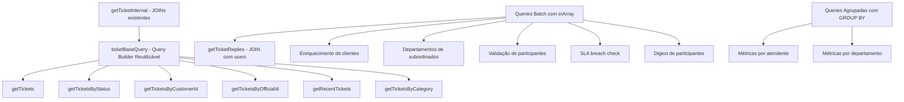

# Documento de Design — Correção de N+1 Queries

## Visão Geral

Este design descreve a abordagem técnica para eliminar 13 padrões de N+1 queries identificados no sistema de gestão de tickets. A estratégia central é criar um **query builder reutilizável** (`ticketBaseQuery`) que encapsula os JOINs já implementados no `getTicketInternal`, permitindo composição com diferentes filtros, paginação e ordenação. Para dados não-ticket (clientes, participantes, métricas), a abordagem é substituir loops com queries individuais por **queries batch** usando `inArray` do Drizzle ORM.

## Arquitetura

### Visão Geral da Abordagem



### Princípios de Design

1. **Reutilização**: O `ticketBaseQuery` centraliza a lógica de JOINs, eliminando duplicação
2. **Composição**: Filtros, paginação e ordenação são compostos sobre a query base
3. **Batch over Loop**: Substituir `Promise.all(items.map(async item => query(item)))` por queries batch com `inArray`
4. **Mapeamento em Memória**: Após queries batch, usar `Map` para lookup O(1) durante o enriquecimento

## Componentes e Interfaces

### 1. ticketBaseQuery — Query Builder Reutilizável

Método privado na classe `DatabaseStorage` que retorna a query base com todos os JOINs necessários.

```typescript
// server/database-storage.ts
private ticketBaseQuery() {
  return db.select({
    // Campos do ticket
    ticket_id: tickets.id,
    ticket_ticket_id: tickets.ticket_id,
    ticket_title: tickets.title,
    ticket_description: tickets.description,
    ticket_status: tickets.status,
    ticket_type: tickets.type,
    ticket_priority: tickets.priority,
    ticket_customer_id: tickets.customer_id,
    ticket_customer_email: tickets.customer_email,
    ticket_assigned_to_id: tickets.assigned_to_id,
    ticket_created_at: tickets.created_at,
    ticket_updated_at: tickets.updated_at,
    ticket_first_response_at: tickets.first_response_at,
    ticket_resolved_at: tickets.resolved_at,
    ticket_sla_breached: tickets.sla_breached,
    ticket_department_id: tickets.department_id,
    ticket_incident_type_id: tickets.incident_type_id,
    ticket_company_id: tickets.company_id,
    ticket_category_id: tickets.category_id,
    // Customer
    customer_id: customers.id,
    customer_name: customers.name,
    customer_email: customers.email,
    customer_phone: customers.phone,
    customer_company: customers.company,
    customer_user_id: customers.user_id,
    customer_avatar_url: customers.avatar_url,
    customer_created_at: customers.created_at,
    customer_updated_at: customers.updated_at,
    customer_company_id: customers.company_id,
    // Official
    official_id: officials.id,
    official_name: officials.name,
    official_email: officials.email,
    official_user_id: officials.user_id,
    official_is_active: officials.is_active,
    official_avatar_url: officials.avatar_url,
    official_created_at: officials.created_at,
    official_updated_at: officials.updated_at,
    official_company_id: officials.company_id,
    official_supervisor_id: officials.supervisor_id,
    official_manager_id: officials.manager_id,
    official_department_id: officials.department_id,
    // Nomes relacionados
    dept_name: departments.name,
    incident_type_name: incidentTypes.name,
    category_name: categories.name,
  })
  .from(tickets)
  .leftJoin(customers, eq(customers.id, tickets.customer_id))
  .leftJoin(officials, eq(officials.id, tickets.assigned_to_id))
  .leftJoin(departments, eq(departments.id, tickets.department_id))
  .leftJoin(incidentTypes, eq(incidentTypes.id, tickets.incident_type_id))
  .leftJoin(categories, eq(categories.id, tickets.category_id));
}
```

### 2. mapTicketResult — Mapeador de Resultados

Método privado que converte o resultado flat dos JOINs para o formato de objeto `Ticket` esperado pelo sistema. Extraído da lógica já existente no `getTicketInternal`.

```typescript
private mapTicketResult(result: TicketBaseQueryResult): Ticket {
  const ticket = {
    id: result.ticket_id,
    ticket_id: result.ticket_ticket_id,
    title: result.ticket_title,
    // ... demais campos
  };

  const customerData = result.customer_id ? {
    id: result.customer_id,
    name: result.customer_name,
    // ... demais campos
  } : undefined;

  const officialData = result.official_id ? {
    id: result.official_id,
    name: result.official_name,
    // ... demais campos
    departments: [],
  } : undefined;

  return {
    ...ticket,
    customer: customerData || {},
    official: officialData,
    replies: [],
    department_name: result.dept_name || undefined,
    incident_type_name: result.incident_type_name || undefined,
    category_name: result.category_name || undefined,
  } as Ticket;
}
```

### 3. Batch Replies — getTicketRepliesBatch

Novo método para buscar replies de múltiplos tickets em uma única query.

```typescript
async getTicketRepliesBatch(ticketIds: number[]): Promise<Map<number, TicketReply[]>> {
  if (ticketIds.length === 0) return new Map();
  
  const results = await db.select({
    reply: getTableColumns(ticketReplies),
    user_id: users.id,
    user_username: users.username,
    user_email: users.email,
    user_name: users.name,
    user_role: users.role,
    user_avatar_url: users.avatar_url,
  })
  .from(ticketReplies)
  .leftJoin(users, eq(users.id, ticketReplies.user_id))
  .where(inArray(ticketReplies.ticket_id, ticketIds))
  .orderBy(ticketReplies.created_at);

  // Agrupar por ticket_id
  const map = new Map<number, TicketReply[]>();
  for (const r of results) {
    const ticketId = r.reply.ticket_id;
    const arr = map.get(ticketId) || [];
    arr.push({ ...r.reply, user: r.user_id ? { id: r.user_id, ... } : undefined });
    map.set(ticketId, arr);
  }
  return map;
}
```

### 4. Métricas Agrupadas — getMetricsGroupedByOfficial / getMetricsGroupedByDepartment

Novas funções no Storage que calculam métricas agrupadas em uma única query com `GROUP BY`.

```typescript
async getMetricsGroupedByOfficial(
  officialIds: number[],
  startDate?: Date,
  endDate?: Date,
  companyId?: number
): Promise<Map<number, { avgFirstResponse: number; avgResolution: number }>>

async getMetricsGroupedByDepartment(
  departmentIds: number[],
  startDate?: Date,
  endDate?: Date,
  companyId?: number
): Promise<Map<number, { avgFirstResponse: number; avgResolution: number }>>
```

### 5. Batch de Departamentos de Officials

Novo método para buscar departamentos de múltiplos officials de uma vez.

```typescript
async getOfficialDepartmentsBatch(officialIds: number[]): Promise<Map<number, string[]>> {
  if (officialIds.length === 0) return new Map();
  
  const results = await db.select({
    official_id: officialDepartments.official_id,
    dept_name: departments.name,
  })
  .from(officialDepartments)
  .innerJoin(departments, eq(departments.id, officialDepartments.department_id))
  .where(inArray(officialDepartments.official_id, officialIds));

  const map = new Map<number, string[]>();
  for (const r of results) {
    const arr = map.get(r.official_id) || [];
    arr.push(r.dept_name);
    map.set(r.official_id, arr);
  }
  return map;
}
```

## Modelos de Dados

Não há alterações nos modelos de dados existentes. As tabelas e schemas do Drizzle ORM permanecem inalterados. As mudanças são exclusivamente na camada de queries (como os dados são buscados), não na estrutura dos dados.

### Tipo auxiliar para o Query Builder

```typescript
// Tipo inferido do retorno de ticketBaseQuery
type TicketBaseQueryResult = Awaited<ReturnType<DatabaseStorage['ticketBaseQuery']>>[number];
```


## Propriedades de Corretude

*Uma propriedade é uma característica ou comportamento que deve ser verdadeiro em todas as execuções válidas de um sistema — essencialmente, uma declaração formal sobre o que o sistema deve fazer. Propriedades servem como ponte entre especificações legíveis por humanos e garantias de corretude verificáveis por máquina.*

### Property 1: Equivalência de dados após otimização

*Para qualquer* ticket existente no banco de dados, o resultado retornado pelo método otimizado (usando `ticketBaseQuery` + `mapTicketResult`) deve conter os mesmos campos e valores que o resultado retornado pelo método original (`getTicketInternal`), exceto pelo campo `replies` que pode ser carregado separadamente.

**Validates: Requirements 10.1, 10.2, 1.1**

### Property 2: Filtros preservam semântica

*Para qualquer* filtro (status, customer_id, official_id) aplicado via `ticketBaseQuery`, todos os tickets retornados devem satisfazer a condição do filtro, e nenhum ticket que satisfaça a condição deve ser omitido do resultado.

**Validates: Requirements 3.1, 3.2, 3.3, 1.2**

### Property 3: Ordenação e limite são respeitados

*Para qualquer* chamada a `getRecentTickets(limit)`, o resultado deve conter no máximo `limit` tickets, e os tickets devem estar ordenados por `created_at` em ordem decrescente (cada ticket[i].created_at >= ticket[i+1].created_at).

**Validates: Requirements 3.4**

### Property 4: Mapeamento produz estrutura válida de Ticket

*Para qualquer* resultado de JOIN retornado pelo `ticketBaseQuery`, o `mapTicketResult` deve produzir um objeto com todos os campos obrigatórios de Ticket (id, ticket_id, title, status, created_at, etc.), e os campos de customer/official devem ser objetos válidos quando os IDs correspondentes existem, ou undefined/objeto vazio quando não existem.

**Validates: Requirements 1.4**

### Property 5: Métricas agrupadas são equivalentes às individuais

*Para qualquer* conjunto de atendentes ou departamentos, as métricas calculadas pela função agrupada (`getMetricsGroupedByOfficial`/`getMetricsGroupedByDepartment`) devem produzir os mesmos valores de tempo médio de primeira resposta e tempo médio de resolução que calcular individualmente para cada atendente/departamento.

**Validates: Requirements 5.1, 5.2**

### Property 6: Enriquecimento via JOIN é equivalente ao individual

*Para qualquer* conjunto de categorias com incident_types e companies associados, o enriquecimento via LEFT JOIN na query original deve produzir os mesmos dados de incident_type e company que o enriquecimento individual (query por categoria).

**Validates: Requirements 7.1, 7.2**

### Property 7: Validação batch identifica IDs faltantes corretamente

*Para qualquer* conjunto de IDs de usuário onde alguns existem e outros não, a validação batch deve retornar um erro que identifica exatamente os IDs que não foram encontrados, sem falsos positivos nem falsos negativos.

**Validates: Requirements 9.2**

### Property 8: Filtros de segurança são preservados

*Para qualquer* combinação de company_id e role de usuário, os métodos otimizados devem retornar exatamente o mesmo conjunto de tickets que os métodos originais, respeitando as regras de multi-tenancy e visibilidade por role.

**Validates: Requirements 10.3, 10.4**

## Tratamento de Erros

### Estratégia Geral

As otimizações não alteram o tratamento de erros existente. Cada método otimizado deve:

1. **Manter os try/catch existentes**: Os blocos de tratamento de erro dos métodos originais são preservados
2. **Tratar arrays vazios no inArray**: Quando `inArray` recebe um array vazio, o Drizzle ORM pode gerar SQL inválido. Verificar `if (ids.length === 0) return new Map()` antes de executar queries batch
3. **Tratar resultados nulos nos JOINs**: LEFT JOINs podem retornar null para tabelas relacionadas. O `mapTicketResult` já trata isso (padrão existente no `getTicketInternal`)
4. **Logging**: Manter os `console.error` existentes para rastreabilidade

### Casos Específicos

- **ticketBaseQuery com filtro vazio**: Retorna todos os tickets (comportamento existente)
- **getTicketRepliesBatch com ticketIds vazio**: Retorna Map vazio sem executar query
- **getMetricsGroupedByOfficial com officialIds vazio**: Retorna Map vazio sem executar query
- **Validação batch com IDs inexistentes**: Retorna erro com lista dos IDs não encontrados

## Estratégia de Testes

### Abordagem Dual

- **Testes unitários**: Verificam exemplos específicos, edge cases e condições de erro
- **Testes de propriedade**: Verificam propriedades universais em inputs gerados aleatoriamente

### Biblioteca de Property-Based Testing

- **fast-check** para TypeScript/Node.js (biblioteca mais madura para PBT em JS/TS)
- Configuração: mínimo de 100 iterações por teste de propriedade

### Testes de Propriedade

Cada propriedade do design deve ser implementada como um teste de propriedade separado usando fast-check:

- **Feature: n-plus-1-query-fixes, Property 1**: Equivalência de dados — gerar tickets aleatórios, comparar resultado otimizado vs original
- **Feature: n-plus-1-query-fixes, Property 2**: Filtros — gerar filtros aleatórios, verificar que todos os resultados satisfazem o filtro
- **Feature: n-plus-1-query-fixes, Property 3**: Ordenação — gerar tickets com datas aleatórias, verificar ordenação decrescente
- **Feature: n-plus-1-query-fixes, Property 4**: Mapeamento — gerar resultados de JOIN aleatórios, verificar estrutura do Ticket
- **Feature: n-plus-1-query-fixes, Property 5**: Métricas — gerar dados de tickets aleatórios, comparar métricas agrupadas vs individuais
- **Feature: n-plus-1-query-fixes, Property 6**: Enriquecimento — gerar categorias aleatórias, comparar JOIN vs individual
- **Feature: n-plus-1-query-fixes, Property 7**: Validação batch — gerar conjuntos de IDs com alguns inválidos, verificar erro correto
- **Feature: n-plus-1-query-fixes, Property 8**: Segurança — gerar combinações de company_id e role, comparar resultados

### Testes Unitários

- Edge cases: arrays vazios, tickets sem customer/official, categorias sem incident_type
- Integração: verificar que endpoints HTTP retornam os mesmos dados após otimização
- Regressão: comparar respostas de API antes e depois da refatoração

### Nota sobre Testes de Integração com Banco

Como as otimizações são sobre queries SQL, os testes mais valiosos são testes de integração que executam contra um banco PostgreSQL real (ou de teste). Os testes de propriedade para Properties 1, 2, 5, 6 e 8 devem idealmente rodar contra o banco para validar que as queries SQL produzem resultados equivalentes.
