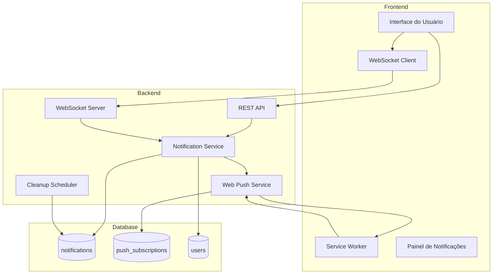

# Documento de Design - Sistema de Notificações Persistentes

## Overview

O sistema de notificações será modernizado para incluir persistência em banco de dados, histórico completo, suporte a Web Push, e gerenciamento avançado de notificações. A arquitetura manterá compatibilidade com o sistema WebSocket existente enquanto adiciona novas capacidades de armazenamento e entrega.

### Objetivos Principais

1. **Persistência**: Todas as notificações serão armazenadas no banco de dados
2. **Histórico**: Usuários poderão acessar notificações antigas
3. **Web Push**: Notificações push para usuários offline
4. **Gerenciamento**: Marcar como lido, excluir, filtrar notificações
5. **Retrocompatibilidade**: Manter APIs existentes funcionando
6. **Performance**: Sistema escalável com limpeza automática

### Estratégia de Migração

- Adicionar nova tabela `notifications` sem modificar código existente
- Estender `NotificationService` para persistir notificações
- Adicionar nova tabela `push_subscriptions` para Web Push
- Criar novos endpoints REST para gerenciamento de notificações
- Implementar Service Worker para Web Push
- Manter WebSocket para entrega em tempo real

## Architecture

### Diagrama de Componentes



### Fluxo de Dados

#### Criação de Notificação

1. Evento ocorre no sistema (novo ticket, resposta, etc.)
2. `NotificationService` é chamado com payload da notificação
3. Notificação é persistida no banco de dados
4. Se usuário está online: entrega via WebSocket
5. Se usuário está offline e tem push subscription: entrega via Web Push
6. Frontend atualiza UI e contador de não lidas

#### Recuperação de Notificações

1. Usuário faz login ou abre painel de notificações
2. Frontend chama API REST `/api/notifications`
3. Backend busca notificações do banco com filtros e paginação
4. Frontend exibe notificações e contador atualizado

#### Marcação como Lida

1. Usuário visualiza ou clica em notificação
2. Frontend chama API `/api/notifications/:id/read`
3. Backend atualiza campo `read_at` no banco
4. Backend retorna contador atualizado
5. Frontend atualiza UI

## Components and Interfaces

### 1. Database Schema

#### Tabela `notifications`

```typescript
export const notifications = pgTable("notifications", {
  id: serial("id").primaryKey(),
  user_id: integer("user_id").references(() => users.id, { onDelete: 'cascade' }).notNull(),
  type: text("type").notNull(), // 'new_ticket', 'status_change', 'new_reply', etc.
  title: text("title").notNull(),
  message: text("message").notNull(),
  priority: text("priority").notNull().default('medium'), // 'low', 'medium', 'high', 'critical'
  
  // Metadados opcionais para contexto
  ticket_id: integer("ticket_id").references(() => tickets.id, { onDelete: 'cascade' }),
  ticket_code: text("ticket_code"),
  
  // Metadados adicionais em JSON
  metadata: jsonb("metadata"), // { participantId, participantName, action, etc. }
  
  // Controle de leitura
  read_at: timestamp("read_at"),
  
  // Timestamps
  created_at: timestamp("created_at").defaultNow().notNull(),
});
```

#### Tabela `push_subscriptions`

```typescript
export const pushSubscriptions = pgTable("push_subscriptions", {
  id: serial("id").primaryKey(),
  user_id: integer("user_id").references(() => users.id, { onDelete: 'cascade' }).notNull(),
  
  // Dados da subscription do navegador
  endpoint: text("endpoint").notNull().unique(),
  p256dh_key: text("p256dh_key").notNull(),
  auth_key: text("auth_key").notNull(),
  
  // Metadados
  user_agent: text("user_agent"),
  
  // Timestamps
  created_at: timestamp("created_at").defaultNow().notNull(),
  last_used_at: timestamp("last_used_at"),
});
```

### 2. Backend Services

#### NotificationService (Estendido)

```typescript
interface NotificationPayload {
  type: string;
  title: string;
  message: string;
  ticketId?: number;
  ticketCode?: string;
  timestamp: Date;
  priority?: 'low' | 'medium' | 'high' | 'critical';
  metadata?: Record<string, any>;
}

interface PersistentNotification {
  id: number;
  userId: number;
  type: string;
  title: string;
  message: string;
  priority: string;
  ticketId?: number;
  ticketCode?: string;
  metadata?: any;
  readAt?: Date;
  createdAt: Date;
}

class NotificationService {
  // Métodos existentes mantidos
  public addClient(ws: WebSocketWithUser, userId: number, userRole: string): void;
  public removeClient(ws: WebSocketWithUser): void;
  public async sendNotificationToUser(userId: number, payload: NotificationPayload): Promise<void>;
  public async sendNotificationToAdmins(payload: NotificationPayload): Promise<void>;
  public async sendNotificationToSupport(payload: NotificationPayload): Promise<void>;
  
  // Novos métodos para persistência
  private async persistNotification(userId: number, payload: NotificationPayload): Promise<PersistentNotification>;
  private async deliverViaWebSocket(userId: number, payload: NotificationPayload): Promise<boolean>;
  private async deliverViaWebPush(userId: number, notification: PersistentNotification): Promise<boolean>;
  
  // Métodos de gerenciamento
  public async getNotifications(userId: number, options: GetNotificationsOptions): Promise<NotificationList>;
  public async markAsRead(notificationId: number, userId: number): Promise<void>;
  public async markAllAsRead(userId: number): Promise<void>;
  public async deleteNotification(notificationId: number, userId: number): Promise<void>;
  public async getUnreadCount(userId: number): Promise<number>;
}

interface GetNotificationsOptions {
  page?: number;
  limit?: number;
  type?: string;
  read?: boolean;
  startDate?: Date;
  endDate?: Date;
  search?: string;
}

interface NotificationList {
  notifications: PersistentNotification[];
  total: number;
  unreadCount: number;
  page: number;
  limit: number;
  hasMore: boolean;
}
```

#### WebPushService (Novo)

```typescript
interface PushSubscriptionData {
  endpoint: string;
  keys: {
    p256dh: string;
    auth: string;
  };
}

class WebPushService {
  // Configuração VAPID
  private vapidPublicKey: string;
  private vapidPrivateKey: string;
  private vapidSubject: string;
  
  // Gerenciamento de subscriptions
  public async subscribe(userId: number, subscription: PushSubscriptionData, userAgent?: string): Promise<void>;
  public async unsubscribe(userId: number, endpoint: string): Promise<void>;
  public async getSubscriptions(userId: number): Promise<PushSubscriptionData[]>;
  
  // Envio de notificações
  public async sendPushNotification(userId: number, notification: PersistentNotification): Promise<void>;
  private async sendToSubscription(subscription: PushSubscriptionData, payload: any): Promise<boolean>;
  
  // Limpeza de subscriptions inválidas
  private async removeInvalidSubscription(endpoint: string): Promise<void>;
}
```

#### CleanupScheduler (Novo)

```typescript
class CleanupScheduler {
  // Configuração
  private readonly READ_RETENTION_DAYS = 90;
  private readonly UNREAD_RETENTION_DAYS = 180;
  private readonly SCHEDULE_CRON = '0 3 * * *'; // 3h da manhã
  
  // Inicialização
  public start(): void;
  public stop(): void;
  
  // Limpeza
  private async cleanupOldNotifications(): Promise<void>;
  private async removeReadNotifications(olderThanDays: number): Promise<number>;
  private async removeUnreadNotifications(olderThanDays: number): Promise<number>;
}
```

### 3. REST API Endpoints

```typescript
// Listar notificações
GET /api/notifications
Query params: page, limit, type, read, startDate, endDate, search
Response: NotificationList

// Obter contador de não lidas
GET /api/notifications/unread-count
Response: { count: number }

// Marcar como lida
PATCH /api/notifications/:id/read
Response: { success: boolean, unreadCount: number }

// Marcar todas como lidas
PATCH /api/notifications/read-all
Response: { success: boolean, unreadCount: number }

// Excluir notificação
DELETE /api/notifications/:id
Response: { success: boolean }

// Excluir múltiplas notificações
DELETE /api/notifications
Body: { ids: number[] }
Response: { success: boolean, deletedCount: number }

// Registrar push subscription
POST /api/notifications/push/subscribe
Body: PushSubscriptionData
Response: { success: boolean }

// Remover push subscription
POST /api/notifications/push/unsubscribe
Body: { endpoint: string }
Response: { success: boolean }

// Obter chave pública VAPID
GET /api/notifications/push/public-key
Response: { publicKey: string }
```

### 4. Frontend Components

#### NotificationPanel Component

```typescript
interface NotificationPanelProps {
  open: boolean;
  onClose: () => void;
}

// Funcionalidades:
// - Listar notificações com scroll infinito
// - Filtrar por tipo, status de leitura, data
// - Buscar por texto
// - Marcar como lida ao clicar
// - Botão "Marcar todas como lidas"
// - Excluir notificações individuais
// - Navegar para contexto (ticket) ao clicar
```

#### useNotifications Hook (Estendido)

```typescript
interface UseNotificationsReturn {
  // Estado
  notifications: PersistentNotification[];
  unreadCount: number;
  loading: boolean;
  hasMore: boolean;
  
  // WebSocket (existente)
  connected: boolean;
  
  // Ações
  loadMore: () => Promise<void>;
  markAsRead: (id: number) => Promise<void>;
  markAllAsRead: () => Promise<void>;
  deleteNotification: (id: number) => Promise<void>;
  refresh: () => Promise<void>;
  
  // Filtros
  setFilters: (filters: NotificationFilters) => void;
  filters: NotificationFilters;
}

interface NotificationFilters {
  type?: string;
  read?: boolean;
  startDate?: Date;
  endDate?: Date;
  search?: string;
}
```

#### Service Worker

```typescript
// sw.js - Service Worker para Web Push

// Instalação e ativação
self.addEventListener('install', (event) => {
  // Configuração inicial
});

self.addEventListener('activate', (event) => {
  // Limpeza de caches antigos
});

// Receber notificação push
self.addEventListener('push', (event) => {
  const data = event.data.json();
  
  // Exibir notificação
  self.registration.showNotification(data.title, {
    body: data.message,
    icon: '/logo_muda.png',
    badge: '/pwa-96x96.png',
    tag: `notification-${data.id}`,
    data: {
      notificationId: data.id,
      ticketId: data.ticketId,
      ticketCode: data.ticketCode,
      url: data.url
    },
    requireInteraction: data.priority === 'critical',
    vibrate: data.priority === 'critical' ? [200, 100, 200] : [100],
  });
});

// Clicar na notificação
self.addEventListener('notificationclick', (event) => {
  event.notification.close();
  
  const data = event.notification.data;
  const url = data.url || '/';
  
  // Abrir ou focar janela da aplicação
  event.waitUntil(
    clients.matchAll({ type: 'window', includeUncontrolled: true })
      .then((clientList) => {
        // Focar janela existente ou abrir nova
        for (const client of clientList) {
          if (client.url === url && 'focus' in client) {
            return client.focus();
          }
        }
        if (clients.openWindow) {
          return clients.openWindow(url);
        }
      })
  );
});
```

## Data Models

### Notification Model

```typescript
interface Notification {
  id: number;
  userId: number;
  type: NotificationType;
  title: string;
  message: string;
  priority: NotificationPriority;
  ticketId?: number;
  ticketCode?: string;
  metadata?: NotificationMetadata;
  readAt?: Date;
  createdAt: Date;
}

type NotificationType = 
  | 'new_ticket'
  | 'status_change'
  | 'new_reply'
  | 'participant_added'
  | 'participant_removed'
  | 'ticket_escalated'
  | 'ticket_due_soon'
  | 'new_customer'
  | 'new_user'
  | 'system_maintenance';

type NotificationPriority = 'low' | 'medium' | 'high' | 'critical';

interface NotificationMetadata {
  participantId?: number;
  participantName?: string;
  action?: string;
  oldStatus?: string;
  newStatus?: string;
  [key: string]: any;
}
```

### PushSubscription Model

```typescript
interface PushSubscription {
  id: number;
  userId: number;
  endpoint: string;
  p256dhKey: string;
  authKey: string;
  userAgent?: string;
  createdAt: Date;
  lastUsedAt?: Date;
}
```

## Correctness Properties

*A property is a characteristic or behavior that should hold true across all valid executions of a system-essentially, a formal statement about what the system should do. Properties serve as the bridge between human-readable specifications and machine-verifiable correctness guarantees.*


### Property 1: Persistência completa de notificações

*Para qualquer* notificação criada pelo sistema, a notificação deve ser armazenada no banco de dados com todos os campos obrigatórios (user_id, type, title, message, priority, created_at) preenchidos corretamente.

**Validates: Requirements 1.1**

### Property 2: Entrega dual para usuários online

*Para qualquer* usuário online que recebe uma notificação, a notificação deve ser entregue via WebSocket em tempo real E deve ser persistida no banco de dados.

**Validates: Requirements 1.2**

### Property 3: Persistência para usuários offline

*Para qualquer* usuário offline que deveria receber uma notificação, a notificação deve ser armazenada no banco de dados para recuperação posterior.

**Validates: Requirements 1.3**

### Property 4: Recuperação de notificações não lidas na conexão

*Para qualquer* usuário que se conecta ao sistema, todas as notificações não lidas (read_at IS NULL) devem ser recuperadas do banco de dados e disponibilizadas ao usuário.

**Validates: Requirements 1.4**

### Property 5: Ordenação e paginação do histórico

*Para qualquer* solicitação de histórico de notificações, as notificações devem ser retornadas ordenadas por created_at em ordem decrescente, com paginação funcionando corretamente (respeitando page e limit).

**Validates: Requirements 1.5**

### Property 6: Marcação de leitura persiste no banco

*Para qualquer* notificação visualizada por um usuário, o campo read_at deve ser atualizado no banco de dados com um timestamp válido.

**Validates: Requirements 2.1, 2.2**

### Property 7: Marcação em lote de todas como lidas

*Para qualquer* usuário com notificações não lidas, ao solicitar marcar todas como lidas, todas as notificações não lidas devem ter read_at atualizado.

**Validates: Requirements 2.3**

### Property 8: Exclusão remove permanentemente

*Para qualquer* notificação excluída por um usuário, a notificação não deve mais existir no banco de dados após a operação.

**Validates: Requirements 2.4**

### Property 9: Exclusão em lote funciona corretamente

*Para qualquer* conjunto de IDs de notificações fornecido para exclusão, todas as notificações correspondentes devem ser removidas do banco de dados.

**Validates: Requirements 2.5**

### Property 10: Contador atualizado após mudança de status

*Para qualquer* operação que altera o status de leitura de notificações (marcar como lida, marcar todas como lidas), o contador de não lidas retornado deve refletir o estado atual correto no banco de dados.

**Validates: Requirements 2.6, 6.2, 6.3, 6.4**

### Property 11: Push subscription persiste corretamente

*Para qualquer* push subscription criada, a subscription deve ser armazenada no banco de dados com endpoint, p256dh_key, auth_key e user_id corretos.

**Validates: Requirements 3.3**

### Property 12: Web Push para usuários offline

*Para qualquer* usuário offline com push subscription ativa, ao criar uma notificação, o sistema deve tentar enviar via Web Push.

**Validates: Requirements 3.4**

### Property 13: Remoção de subscription ao revogar

*Para qualquer* push subscription revogada por um usuário, a subscription deve ser removida do banco de dados.

**Validates: Requirements 3.5**

### Property 14: Limpeza de subscriptions inválidas

*Para qualquer* push subscription que retorna erro 410 (Gone), a subscription deve ser automaticamente removida do banco de dados.

**Validates: Requirements 3.6, 7.4**

### Property 15: Retrocompatibilidade de métodos existentes

*Para qualquer* método público existente do NotificationService (sendNotificationToUser, sendNotificationToAdmins, sendNotificationToSupport, etc.), o método deve continuar funcionando corretamente E deve adicionar persistência no banco de dados.

**Validates: Requirements 4.2, 4.3**

### Property 16: Limpeza de notificações lidas antigas

*Para qualquer* notificação lida (read_at NOT NULL) com mais de 90 dias, a limpeza automática deve remover a notificação do banco de dados.

**Validates: Requirements 5.1**

### Property 17: Limpeza de notificações não lidas antigas

*Para qualquer* notificação não lida (read_at IS NULL) com mais de 180 dias, a limpeza automática deve remover a notificação do banco de dados.

**Validates: Requirements 5.2**

### Property 18: Logging de limpeza

*Para qualquer* execução de limpeza automática, o sistema deve registrar no log a quantidade de notificações removidas (lidas e não lidas separadamente).

**Validates: Requirements 5.3**

### Property 19: Integridade referencial na limpeza

*Para qualquer* remoção de notificações antigas, outras tabelas do banco de dados não devem ser afetadas (tickets, users, etc. devem permanecer intactos).

**Validates: Requirements 5.5**

### Property 20: Contador correto na conexão

*Para qualquer* usuário que se conecta ao sistema, o contador de notificações não lidas retornado deve ser igual ao número de notificações com read_at IS NULL no banco de dados.

**Validates: Requirements 6.1**

### Property 21: Sincronização de contador via WebSocket

*Para qualquer* atualização de contador de notificações não lidas, se o usuário estiver online (WebSocket conectado), a atualização deve ser enviada via WebSocket.

**Validates: Requirements 6.5**

### Property 22: Resiliência a falhas de WebSocket

*Para qualquer* falha no envio via WebSocket, o erro deve ser registrado E a notificação deve ser persistida no banco de dados normalmente.

**Validates: Requirements 7.1**

### Property 23: Resiliência a falhas de Web Push

*Para qualquer* falha no envio via Web Push, o erro deve ser registrado E a notificação deve ser mantida no banco de dados para recuperação.

**Validates: Requirements 7.2**

### Property 24: Tratamento de falha crítica de persistência

*Para qualquer* falha na persistência no banco de dados, o erro crítico deve ser registrado E o sistema deve tentar entregar via WebSocket se o usuário estiver online.

**Validates: Requirements 7.3**

### Property 25: Logging completo de erros

*Para qualquer* erro em operações de notificação, o log deve conter detalhes completos incluindo mensagem de erro, stack trace e contexto da operação.

**Validates: Requirements 7.5**

### Property 26: Filtragem por tipo funciona corretamente

*Para qualquer* solicitação de notificações filtradas por tipo, apenas notificações do tipo especificado devem ser retornadas.

**Validates: Requirements 8.1**

### Property 27: Filtragem por status de leitura

*Para qualquer* solicitação de notificações filtradas por status de leitura (read=true ou read=false), apenas notificações com o status correspondente devem ser retornadas.

**Validates: Requirements 8.2**

### Property 28: Filtragem por período de datas

*Para qualquer* solicitação de notificações filtradas por período (startDate e endDate), apenas notificações com created_at dentro do intervalo devem ser retornadas.

**Validates: Requirements 8.3**

### Property 29: Busca textual funciona

*Para qualquer* busca textual em notificações, apenas notificações cujo title ou message contenham o texto buscado (case-insensitive) devem ser retornadas.

**Validates: Requirements 8.4**

### Property 30: Combinação de filtros usa AND

*Para qualquer* solicitação com múltiplos filtros aplicados, os resultados devem satisfazer TODOS os filtros simultaneamente (operador AND).

**Validates: Requirements 8.5**

### Property 31: Validação de prioridades

*Para qualquer* notificação criada, o campo priority deve aceitar apenas valores válidos (low, medium, high, critical).

**Validates: Requirements 9.1**

### Property 32: Configuração de Web Push para notificações críticas

*Para qualquer* notificação com priority='critical' enviada via Web Push, a configuração deve incluir requireInteraction=true e vibrate pattern apropriado.

**Validates: Requirements 9.2**

### Property 33: Prioridade incluída nos dados retornados

*Para qualquer* notificação retornada pela API, o campo priority deve estar presente nos dados.

**Validates: Requirements 9.3**

### Property 34: Prioridade padrão é medium

*Para qualquer* notificação criada sem especificar priority, o valor padrão deve ser 'medium'.

**Validates: Requirements 9.5**

### Property 35: Metadados de ticket incluídos

*Para qualquer* notificação relacionada a um ticket, os campos ticket_id e ticket_code devem estar presentes nos dados da notificação.

**Validates: Requirements 10.1, 10.2**

### Property 36: Clique marca como lida

*Para qualquer* notificação de ticket clicada pelo usuário, a notificação deve ser marcada como lida (read_at atualizado) no banco de dados.

**Validates: Requirements 10.3**

### Property 37: Metadados customizados permitidos

*Para qualquer* notificação não relacionada a ticket, o campo metadata deve aceitar dados JSON customizados opcionais.

**Validates: Requirements 10.5**

## Error Handling

### Estratégia de Tratamento de Erros

O sistema implementa tratamento de erros em múltiplas camadas para garantir resiliência:

#### 1. Falhas de Entrega

- **WebSocket**: Se falhar, registra erro mas continua com persistência
- **Web Push**: Se falhar, registra erro mas mantém notificação no banco
- **Banco de Dados**: Se falhar, registra erro crítico e tenta WebSocket

#### 2. Subscriptions Inválidas

- Erro 410 (Gone): Remove subscription automaticamente
- Erro 404 (Not Found): Remove subscription automaticamente
- Outros erros: Registra mas mantém subscription para retry

#### 3. Validação de Dados

- Campos obrigatórios faltando: Rejeita com erro 400
- Prioridade inválida: Usa 'medium' como fallback
- User ID inválido: Rejeita com erro 404

#### 4. Limites e Rate Limiting

- Paginação: Máximo 100 notificações por página
- Exclusão em lote: Máximo 100 notificações por operação
- Web Push: Retry com backoff exponencial (3 tentativas)

#### 5. Logging

Todos os erros são registrados com:
- Timestamp
- Tipo de erro
- Mensagem detalhada
- Stack trace
- Contexto (userId, notificationId, etc.)
- Severidade (info, warning, error, critical)

### Códigos de Erro HTTP

```typescript
// Sucesso
200 OK - Operação bem-sucedida
201 Created - Notificação ou subscription criada

// Erros do Cliente
400 Bad Request - Dados inválidos
401 Unauthorized - Não autenticado
403 Forbidden - Sem permissão
404 Not Found - Notificação ou usuário não encontrado
409 Conflict - Subscription já existe

// Erros do Servidor
500 Internal Server Error - Erro genérico
503 Service Unavailable - Serviço temporariamente indisponível
```

## Testing Strategy

### Abordagem Dual de Testes

O sistema será testado usando duas abordagens complementares:

#### 1. Testes Unitários

Testes unitários verificarão:
- Exemplos específicos de notificações
- Casos extremos (edge cases)
- Condições de erro conhecidas
- Integração entre componentes
- Comportamento de UI

**Framework**: Jest com TypeScript

**Exemplos de testes unitários**:
- Criar notificação com todos os campos obrigatórios
- Marcar notificação específica como lida
- Excluir notificação e verificar remoção
- Testar filtros com dados conhecidos
- Verificar formatação de datas

#### 2. Testes Baseados em Propriedades (Property-Based Testing)

Testes de propriedade verificarão:
- Propriedades universais que devem valer para TODAS as entradas
- Invariantes do sistema
- Comportamento com dados aleatórios
- Casos extremos não previstos

**Framework**: fast-check (biblioteca de PBT para TypeScript/JavaScript)

**Configuração**: Cada teste de propriedade executará no mínimo 100 iterações com dados aleatórios

**Formato de anotação**: Cada teste de propriedade será marcado com comentário:
```typescript
// Feature: notification-system, Property X: [texto da propriedade]
```

**Exemplos de testes de propriedade**:
- Para qualquer notificação criada, deve ser persistida com campos obrigatórios
- Para qualquer usuário com N notificações não lidas, contador deve ser N
- Para qualquer filtro aplicado, resultados devem satisfazer o filtro
- Para qualquer operação de exclusão, notificação não deve existir após
- Para qualquer ordenação, ordem deve ser consistente

#### 3. Testes de Integração

Testes de integração verificarão:
- Fluxo completo de criação e entrega de notificação
- Integração com banco de dados real (test database)
- Integração com WebSocket
- Integração com Web Push (mockado)

#### 4. Testes de Service Worker

Testes do Service Worker verificarão:
- Registro correto do SW
- Recebimento de push events
- Exibição de notificações
- Comportamento de clique

**Framework**: Workbox Testing ou Puppeteer

### Cobertura de Testes

Meta de cobertura:
- Código: 80%+ de cobertura de linhas
- Propriedades: Todas as 37 propriedades implementadas como testes
- Edge cases: Principais casos extremos cobertos por testes unitários

### Estratégia de Mocking

- **Banco de Dados**: Usar banco de teste real (não mock) para testes de integração
- **WebSocket**: Mockar conexões WebSocket em testes unitários
- **Web Push**: Mockar biblioteca web-push em todos os testes
- **Tempo**: Mockar Date.now() para testes de limpeza e timestamps

## Implementation Notes

### Ordem de Implementação Recomendada

1. **Fase 1: Schema e Persistência Básica**
   - Criar tabelas `notifications` e `push_subscriptions`
   - Adicionar métodos de persistência ao `NotificationService`
   - Manter WebSocket funcionando

2. **Fase 2: APIs REST**
   - Implementar endpoints de listagem e contagem
   - Implementar endpoints de marcação como lida
   - Implementar endpoints de exclusão

3. **Fase 3: Frontend Básico**
   - Criar componente `NotificationPanel`
   - Estender hook `useNotifications`
   - Integrar com APIs REST

4. **Fase 4: Web Push**
   - Implementar `WebPushService`
   - Criar Service Worker
   - Adicionar endpoints de subscription
   - Integrar com `NotificationService`

5. **Fase 5: Recursos Avançados**
   - Implementar filtros e busca
   - Implementar limpeza automática
   - Adicionar suporte a prioridades
   - Melhorar tratamento de erros

6. **Fase 6: Testes**
   - Escrever testes de propriedade para cada property
   - Escrever testes unitários para casos específicos
   - Testes de integração end-to-end

### Considerações de Performance

- **Índices de Banco**: Criar índices em `user_id`, `read_at`, `created_at`, `type`
- **Paginação**: Sempre usar paginação para listagens
- **Cache**: Considerar cache de contador de não lidas no Redis
- **Batch Operations**: Usar operações em lote para exclusão e marcação
- **Connection Pooling**: Configurar pool de conexões adequado

### Segurança

- **Autorização**: Usuário só pode acessar suas próprias notificações
- **Validação**: Validar todos os inputs da API
- **SQL Injection**: Usar queries parametrizadas (Drizzle ORM)
- **XSS**: Sanitizar conteúdo de notificações no frontend
- **Rate Limiting**: Limitar requisições por usuário

### Monitoramento

Métricas a serem monitoradas:
- Taxa de entrega de notificações (WebSocket vs Web Push vs Falhas)
- Latência de persistência no banco
- Tamanho da tabela de notificações
- Taxa de limpeza automática
- Erros de Web Push por tipo
- Contador de notificações não lidas por usuário

### Migração de Dados

Não há dados existentes para migrar, pois o sistema atual não persiste notificações. A migração será apenas de código:

1. Deploy da nova tabela via migration
2. Deploy do código atualizado (retrocompatível)
3. Monitorar logs para erros
4. Gradualmente adicionar novos recursos no frontend

### Configuração Necessária

Variáveis de ambiente a adicionar:

```env
# Web Push VAPID Keys
VAPID_PUBLIC_KEY=<chave pública>
VAPID_PRIVATE_KEY=<chave privada>
VAPID_SUBJECT=mailto:admin@example.com

# Limpeza automática
NOTIFICATION_CLEANUP_ENABLED=true
NOTIFICATION_READ_RETENTION_DAYS=90
NOTIFICATION_UNREAD_RETENTION_DAYS=180
```

Gerar chaves VAPID:
```bash
npx web-push generate-vapid-keys
```
