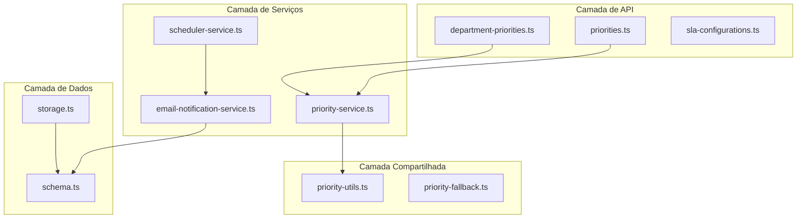

# Design — Correções do Scan Estático

## Visão Geral

Este documento descreve as correções técnicas para os 12 achados do relatório de análise estática do GestãoTickets. As correções são agrupadas por área de impacto e seguem a priorização do relatório (Crítico → Baixo). O projeto já possui um logger Winston estruturado (`server/services/logger.ts`) que será reutilizado para substituir `console.log` de debug.

## Arquitetura

As correções afetam três camadas do sistema:



As correções não alteram a arquitetura geral — são refatorações pontuais e correções de lógica dentro dos módulos existentes.

## Componentes e Interfaces

### 1. Helper compartilhado de Company Filter (Requisitos 2, 12)

Extrair a lógica de parse do filtro de empresas para um helper reutilizável.

**Localização:** `server/utils/company-filter.ts`

```typescript
/**
 * Interpreta SCHEDULER_COMPANY_FILTER e retorna uma função predicado.
 * Formatos suportados: '*', '<>id', 'id1,id2,...', 'id'
 */
export function parseCompanyFilter(filter: string): (companyId: number) => boolean;

/**
 * Expande o filtro para uma lista de company IDs (para digests).
 * Requer a lista de todas as empresas ativas.
 */
export function expandCompanyFilter(
  filter: string,
  allCompanyIds: number[]
): number[];
```

O `SchedulerService` e o `EmailNotificationService.checkWaitingCustomerAutoClose` passam a importar deste helper. A função `parseCompanyFilter` privada do `SchedulerService` e a função local `parseFilter` dentro de `checkWaitingCustomerAutoClose` são removidas.

### 2. Correção do ciclo de alerta waiting_customer (Requisito 1)

**Arquivos afetados:**
- `server/services/email-notification-service.ts` — `checkWaitingCustomerAutoClose()`
- `server/api/ticket-replies.ts` — reset do `alert_sent_at` na resposta do cliente (já existe)
- Lógica de transição de status (onde o ticket entra em `waiting_customer`)

**Mudanças:**
1. Em `checkWaitingCustomerAutoClose`, após obter `entered_at` e `alert_sent_at`, adicionar guarda:
   ```typescript
   // Se alert_sent_at pertence a um ciclo anterior, ignorar
   const effectiveAlertSentAt = (alert_sent_at && entered_at && alert_sent_at >= entered_at)
     ? alert_sent_at
     : null;
   ```
   Usar `effectiveAlertSentAt` no lugar de `alert_sent_at` nas comparações subsequentes.

2. Na transição de status para `waiting_customer` (no handler de criação de reply ou mudança de status), zerar `waiting_customer_alert_sent_at = null`.

3. O reset na resposta do cliente já existe em `server/api/ticket-replies.ts:207`.

### 3. Correção do lookup de prioridades para admin (Requisito 3)

**Arquivo:** `server/api/department-priorities.ts` — funções `updatePriority()` e `deletePriority()`

**Mudança:** Substituir o padrão "carregar todas as prioridades e dar find" por uma busca direta por ID:

```typescript
// ANTES (bugado para admin):
const companyIdToSearch = userRole === 'admin' ? 0 : userCompanyId!;
const existingPriorities = await priorityService.getAllCompanyPriorities(companyIdToSearch);
const existingPriority = existingPriorities.find(p => p.id === priorityId);

// DEPOIS:
const existingPriority = await priorityService.getPriorityById(priorityId);
if (!existingPriority) { return res.status(404)... }
// Verificar permissão usando company_id do registro
if (userRole !== 'admin' && existingPriority.company_id !== userCompanyId) {
  return res.status(403)...
}
```

**Novo método no PriorityService:**
```typescript
async getPriorityById(id: number): Promise<DepartmentPriority | null>;
```

### 4. Consistência do fallback de prioridades (Requisito 4)

**Mudanças:**
- `server/utils/priority-fallback.ts`: Atualizar `testPriorityFallback()` para esperar `source: 'none'` e lista vazia (em vez de `source: 'default'` e 4 prioridades).
- `shared/utils/priority-utils.ts`: Já retorna `source: 'none'` — sem mudança necessária.
- `server/services/priority-service.ts`: Já retorna lista vazia — sem mudança necessária.

### 5. Substituição de console.log por logger (Requisitos 5, 7)

**Arquivos afetados:**
- `shared/utils/priority-utils.ts` — remover todos os `console.log` de debug
- `server/services/priority-service.ts` — substituir `console.log` por `logger.debug()`
- `server/api/sla-configurations.ts` — remover `console.log` do payload completo na criação de SLA; substituir por `logger.debug()` com apenas metadados não-sensíveis (`departmentId`, `companyId`)

O projeto já possui `server/services/logger.ts` com Winston configurado para suprimir debug em produção (`level: process.env.NODE_ENV === 'production' ? 'info' : 'debug'`).

### 6. Parser CSV robusto (Requisito 6)

**Arquivo:** `server/api/sla-configurations.ts` — função `importSLAConfigurationsCSV()`

**Mudança:** Substituir o split manual por uma biblioteca de parsing CSV. Usar `csv-parse/sync` (do pacote `csv-parse`, parte do ecossistema `csv` do npm).

```typescript
import { parse as csvParse } from 'csv-parse/sync';

// Substituir:
// const lines = csvData.split('\n').filter(line => line.trim());
// const headers = lines[0].split(',')...

// Por:
const normalizedCsv = csvData.replace(/\r\n/g, '\n');
const records = csvParse(normalizedCsv, {
  columns: true,
  skip_empty_lines: true,
  trim: true,
  relax_quotes: true,
});
```

Para a verificação de duplicidade em lote: carregar todas as configurações existentes do departamento de uma vez e verificar em memória, em vez de consultar o banco por linha.

### 7. Remoção do @ts-nocheck (Requisito 8)

**Arquivo:** `server/storage.ts`

**Mudanças:**
1. Remover `// @ts-nocheck` da linha 1.
2. Remover a importação de `ticketPriorityEnum` se o enum não existir mais no schema.
3. Corrigir erros de tipagem resultantes (verificar com `getDiagnostics`).

### 8. Consolidação de APIs de prioridades (Requisito 9)

**Mudanças:**
- Mover `getDepartmentPriorities` e `createDefaultPriorities` de `server/api/priorities.ts` para `server/api/department-priorities.ts` (que já tem o CRUD completo).
- Atualizar `server/routes.ts` para importar de `department-priorities.ts` em vez de `priorities.ts`.
- Remover `server/api/priorities.ts` após migração.

### 9. Token seguro para pesquisa de satisfação (Requisito 10)

**Arquivo:** `server/services/email-notification-service.ts` — método `generateSurveyToken()`

```typescript
import crypto from 'crypto';

private generateSurveyToken(): string {
  return `survey_${crypto.randomBytes(16).toString('hex')}`;
}
```

### 10. Janela de horário consistente (Requisito 11)

**Localização:** `server/utils/scheduler-window.ts`

```typescript
/**
 * Verifica se o horário atual está dentro da janela permitida.
 * Janela: 06:01 às 20:59 (inclusive).
 */
export function isWithinAllowedWindow(now?: Date): boolean;
```

Substituir as verificações inline em `checkTickets()`, `runDailyDigest()` e `runWeeklyDigest()` por chamadas a este helper.

## Modelos de Dados

Não há alterações no schema do banco de dados. O campo `waiting_customer_alert_sent_at` já existe na tabela `tickets`. As correções são apenas de lógica de aplicação.

A única mudança de dados é comportamental: o campo `waiting_customer_alert_sent_at` passa a ser zerado (`null`) quando um ticket transiciona para `waiting_customer`, garantindo que cada ciclo comece limpo.


## Propriedades de Corretude

*Uma propriedade é uma característica ou comportamento que deve ser verdadeiro em todas as execuções válidas de um sistema — essencialmente, uma declaração formal sobre o que o sistema deve fazer. Propriedades servem como ponte entre especificações legíveis por humanos e garantias de corretude verificáveis por máquina.*

### Property 1: Effective alert_sent_at respeita o ciclo atual

*Para qualquer* ticket em `waiting_customer` com um `entered_at` e um `alert_sent_at`, se `alert_sent_at < entered_at`, então o `effectiveAlertSentAt` calculado pelo scheduler deve ser `null`. Se `alert_sent_at >= entered_at`, então o `effectiveAlertSentAt` deve ser igual ao `alert_sent_at` original.

**Validates: Requirements 1.1, 1.4**

### Property 2: Reset de alert_sent_at em novo ciclo

*Para qualquer* ticket com qualquer valor de `alert_sent_at`, quando o ticket transiciona para `waiting_customer`, o campo `waiting_customer_alert_sent_at` resultante deve ser `null`.

**Validates: Requirements 1.2, 1.3**

### Property 3: Scheduler não encerra ticket dentro do período de espera

*Para qualquer* ticket em `waiting_customer` cujo `effectiveAlertSentAt` pertence ao ciclo atual e a diferença entre o momento atual e o `effectiveAlertSentAt` é menor que 24 horas, o scheduler não deve encerrar o ticket.

**Validates: Requirements 1.5**

### Property 4: parseCompanyFilter interpreta todos os formatos corretamente

*Para qualquer* company ID e qualquer formato de filtro:
- Se filtro é `*` ou vazio → retorna `true` para todos os IDs
- Se filtro é `<>N` → retorna `true` para todos exceto N
- Se filtro é lista `A,B,C` → retorna `true` apenas para IDs na lista
- Se filtro é ID único `N` → retorna `true` apenas para N
- Valores não-numéricos na lista são ignorados

**Validates: Requirements 2.2, 2.3, 2.4, 2.5**

### Property 5: Controle de acesso por company_id em operações de prioridade

*Para qualquer* usuário não-admin e qualquer prioridade cujo `company_id` difere do `company_id` do usuário, a operação de update ou delete deve ser rejeitada com status 403.

**Validates: Requirements 3.3**

### Property 6: Consistência do fallback de prioridades

*Para qualquer* combinação de `companyId` e `departmentId` sem prioridades customizadas no banco, tanto o `PriorityService.getDepartmentPriorities()` quanto o `getDepartmentPriorities()` de `priority-utils.ts` devem retornar `{ priorities: [], isDefault: true, source: 'none' }`.

**Validates: Requirements 4.1, 4.2, 4.4**

### Property 7: CSV round-trip — campos com caracteres especiais

*Para qualquer* conjunto de registros SLA cujos campos podem conter vírgulas, aspas e quebras de linha, serializar para CSV e depois parsear com o CSV_Parser deve produzir registros equivalentes aos originais.

**Validates: Requirements 6.1, 6.2, 6.3**

### Property 8: Formato e entropia do token de pesquisa de satisfação

*Para qualquer* token gerado por `generateSurveyToken()`, o token deve: (a) começar com o prefixo `survey_`, (b) conter pelo menos 32 caracteres hexadecimais após o prefixo (128 bits de entropia), e (c) ser composto apenas por caracteres válidos (`[a-f0-9_]`).

**Validates: Requirements 10.1, 10.2, 10.3**

### Property 9: Janela de horário do scheduler

*Para qualquer* hora H e minuto M, `isWithinAllowedWindow(date(H, M))` deve retornar `true` se e somente se o horário está entre 06:01 e 20:59 (inclusive). Isso deve ser consistente para checks de tickets e digests.

**Validates: Requirements 11.2, 11.3**

## Tratamento de Erros

| Cenário | Comportamento Esperado |
|---------|----------------------|
| `parseCompanyFilter` recebe valor não-numérico em lista | Ignora o valor, loga warning via `logger.warn()` |
| `getPriorityById` não encontra registro | Retorna `null`, endpoint retorna 404 |
| CSV com formato inválido (sem cabeçalho) | Retorna erro 400 com mensagem descritiva |
| CSV com linha com número errado de colunas | Registra erro na linha, continua processando demais |
| `@ts-nocheck` removido e erros de tipo encontrados | Corrigir tipos; não suprimir erros |
| Token generation falha (crypto indisponível) | Propagar erro; não fazer fallback para Math.random() |

## Estratégia de Testes

### Abordagem Dual

O projeto usa **Vitest** como framework de testes. A estratégia combina:

- **Testes unitários**: Exemplos específicos, edge cases e condições de erro
- **Testes de propriedade**: Propriedades universais validadas com inputs gerados

### Biblioteca de Property-Based Testing

Usar **fast-check** (`fast-check` npm package) com Vitest. Configuração mínima de 100 iterações por propriedade.

### Organização dos Testes

```
server/services/__tests__/
  company-filter.test.ts        — Properties 4
  scheduler-window.test.ts      — Property 9
  waiting-customer-cycle.test.ts — Properties 1, 2, 3
  survey-token.test.ts          — Property 8

server/api/__tests__/
  department-priorities.test.ts  — Property 5

shared/utils/__tests__/
  priority-utils.test.ts         — Property 6

server/api/__tests__/
  sla-csv-import.test.ts         — Property 7
```

### Anotação de Testes

Cada teste de propriedade deve conter um comentário referenciando a propriedade do design:

```typescript
// Feature: static-scan-fixes, Property 4: parseCompanyFilter interpreta todos os formatos corretamente
```

### Testes Unitários

Testes unitários focam em:
- Edge cases do CSV parser (CRLF, aspas escapadas, linhas vazias)
- Prioridade inexistente retorna 404
- Admin consegue atualizar/deletar prioridades de qualquer empresa
- Remoção de `@ts-nocheck` compila sem erros (verificação via `getDiagnostics`)
- Consolidação de rotas não quebra endpoints existentes
