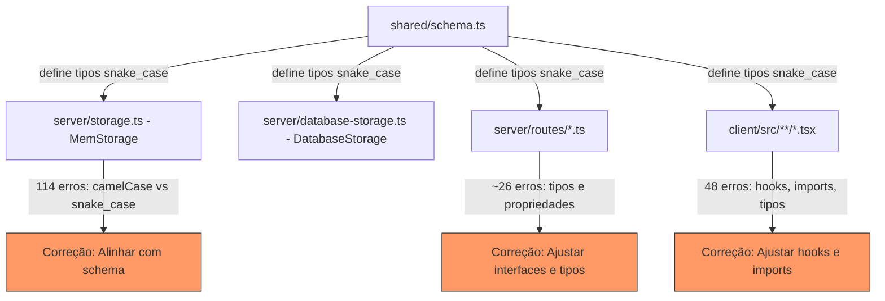
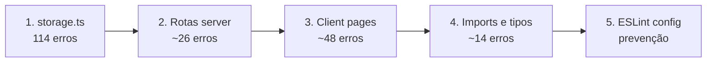

# Design: Correção de Erros TypeScript (Lint/Type Check)

## Visão Geral

Este design descreve a estratégia para corrigir 221 erros de TypeScript no projeto, organizados em 9 categorias de erro. A abordagem é bottom-up: começar pelo arquivo mais afetado (`server/storage.ts` com 114 erros), depois corrigir rotas do server, páginas do client, e finalizar com configuração de ESLint.

A causa raiz principal é a inconsistência entre o schema Drizzle ORM (que usa `snake_case` para nomes de colunas, e os tipos inferidos mantêm essa convenção) e o código do `MemStorage` que usa `camelCase`. Como o Drizzle infere tipos diretamente das definições de tabela, os tipos `User`, `Ticket`, `Customer`, etc. têm propriedades em `snake_case` (`created_at`, `avatar_url`, `company_id`), mas o `MemStorage` tenta criar objetos com `createdAt`, `avatarUrl`, `companyId`.

## Arquitetura



### Fluxo de Correção



## Componentes e Interfaces

### 1. MemStorage (server/storage.ts)

O `MemStorage` é uma implementação in-memory da interface `IStorage`, usada para desenvolvimento/testes. Ele cria objetos literais que devem conformar com os tipos inferidos do Drizzle.

**Problema**: Todos os objetos criados no `MemStorage` usam camelCase (`createdAt`, `updatedAt`, `avatarUrl`, `userId`, `ticketId`, `customerId`, `assignedToId`, `isInternal`, `isActive`, `departmentId`, `firstResponseAt`, `resolvedAt`, `slaBreached`, `customerEmail`, `incidentTypeId`, `categoryId`, `officialDepartmentId`, `changedById`, `oldStatus`, `newStatus`, `changeType`) enquanto os tipos exigem snake_case (`created_at`, `updated_at`, `avatar_url`, `user_id`, `ticket_id`, `customer_id`, `assigned_to_id`, `is_internal`, `is_active`, `department_id`, `first_response_at`, `resolved_at`, `sla_breached`, `customer_email`, `incident_type_id`, `category_id`, `official_department_id`, `changed_by_id`, `old_status`, `new_status`, `change_type`).

**Solução**: Renomear todas as propriedades camelCase para snake_case em todo o `MemStorage`, alinhando com os tipos do schema. Isso inclui:
- `initializeData()`: objetos User, Customer, Official, Ticket, TicketReply
- Todos os métodos `create*()`: User, Customer, Official, Ticket, TicketReply
- Todos os métodos `update*()`: User, Customer, Official, Ticket
- Métodos auxiliares: `addTicketStatusHistory`, `getTicketStats`, etc.
- Acessos a propriedades em filtros e comparações (ex: `ticket.createdAt` → `ticket.created_at`)

### 2. Rotas do Server (server/routes/*.ts)

**Arquivos afetados**:
- `server/routes/service-providers.ts` (9 erros)
- `server/routes/ticket-service-providers.ts` (7 erros)
- `server/routes/department-service-providers.ts` (5 erros)
- Outros arquivos de rotas com erros pontuais

**Problemas**:
- Acesso a propriedades inexistentes nos tipos (TS2339)
- Argumentos com tipos incompatíveis (TS2345)
- Parâmetros sem tipo explícito (TS7006)
- Indexação sem index signature (TS7053)

**Solução**: 
- Ajustar acessos a propriedades para usar os nomes corretos do schema
- Adicionar tipos explícitos a parâmetros de callbacks
- Usar type assertions seguras ou index signatures onde necessário
- Verificar se métodos chamados em `storage` existem na interface `IStorage`

### 3. Hooks e Páginas do Client

**Arquivos afetados**:
- `client/src/pages/inventory/catalog.tsx` (8 erros)
- `client/src/pages/inventory/suppliers.tsx` (6 erros)
- `client/src/pages/inventory/assignments.tsx` (6 erros)
- `client/src/pages/inventory/product-types.tsx` (5 erros)
- `client/src/pages/inventory/movements.tsx` (5 erros)
- `client/src/pages/reports/clients.tsx` (4 erros)
- Outros arquivos com erros pontuais

**Problemas**:
- Propriedades inexistentes no tipo retornado por hooks (TS2339) - ex: `.data`, `.pagination`
- Overload inválido no TanStack Query v5 (TS2769) - `keepPreviousData`
- Imports faltantes de `format`/`ptBR` do `date-fns` (TS2304/TS2552)
- Valores possivelmente undefined (TS18048)
- Tipos incompatíveis em atribuições (TS2322)

**Solução**:
- Ajustar tipagem de retorno dos hooks para incluir `.data` e `.pagination`
- Substituir `keepPreviousData` por `placeholderData: keepPreviousData` (API v5 do TanStack Query)
- Adicionar imports faltantes de `date-fns` e `date-fns/locale`
- Adicionar guard clauses para valores possivelmente undefined
- Corrigir tipos de atribuição

### 4. Declarações de Tipos para Módulos Externos

**Problema**: O módulo `qrcode` não tem declaração de tipos.

**Solução**: Instalar `@types/qrcode` se disponível, ou criar um arquivo `server/types/qrcode.d.ts` com declaração mínima.

### 5. Configuração ESLint

**Problema**: O projeto não tem ESLint configurado nem script `lint` no `package.json`.

**Solução**: Configurar ESLint com `@typescript-eslint` e adicionar script `lint` ao `package.json`.

## Modelos de Dados

Não há alterações nos modelos de dados. O schema Drizzle (`shared/schema.ts`) permanece inalterado. As correções são apenas no código que consome esses tipos.

### Mapeamento de Propriedades (Referência)

| camelCase (errado no MemStorage) | snake_case (correto no schema) |
|---|---|
| `createdAt` | `created_at` |
| `updatedAt` | `updated_at` |
| `avatarUrl` | `avatar_url` |
| `userId` | `user_id` |
| `ticketId` | `ticket_id` |
| `customerId` | `customer_id` |
| `assignedToId` | `assigned_to_id` |
| `companyId` | `company_id` |
| `isInternal` | `is_internal` |
| `isActive` | `is_active` |
| `departmentId` | `department_id` |
| `firstResponseAt` | `first_response_at` |
| `resolvedAt` | `resolved_at` |
| `slaBreached` | `sla_breached` |
| `customerEmail` | `customer_email` |
| `incidentTypeId` | `incident_type_id` |
| `categoryId` | `category_id` |
| `changedById` | `changed_by_id` |
| `oldStatus` | `old_status` |
| `newStatus` | `new_status` |
| `changeType` | `change_type` |
| `adUser` | `ad_user` |
| `mustChangePassword` | `must_change_password` |
| `officialId` | `official_id` |
| `supervisorId` | `supervisor_id` |
| `managerId` | `manager_id` |
| `responseTimeHours` | `response_time_hours` |
| `resolutionTimeHours` | `resolution_time_hours` |
| `waitingCustomerAlertSentAt` | `waiting_customer_alert_sent_at` |


## Propriedades de Corretude

*Uma propriedade é uma característica ou comportamento que deve ser verdadeiro em todas as execuções válidas de um sistema — essencialmente, uma declaração formal sobre o que o sistema deve fazer. Propriedades servem como ponte entre especificações legíveis por humanos e garantias de corretude verificáveis por máquina.*

A maioria dos critérios de aceitação deste spec são verificáveis via `tsc` (type check estático) e não por testes de propriedade em runtime. No entanto, identificamos propriedades testáveis para as partes mais críticas:

### Property 1: Conformidade de objetos MemStorage com tipos do Schema

*Para qualquer* tipo definido no schema Drizzle (User, Customer, Official, Ticket, TicketReply, TicketStatusHistory, OfficialDepartment), os objetos criados pelo MemStorage devem ter exatamente as mesmas chaves que o tipo inferido do schema (snake_case), e nenhuma chave camelCase que não exista no tipo.

**Validates: Requirements 1.1, 1.2, 1.3, 1.4**

### Property 2: Conversão segura de valores Date

*Para qualquer* string ISO 8601 válida ou objeto Date, a conversão para Date deve produzir um objeto Date válido (não NaN) com o mesmo instante temporal.

**Validates: Requirements 3.2**

### Property 3: Acesso seguro a valores possivelmente undefined

*Para qualquer* objeto de resposta NFe (com ou sem campo `products`), o processamento do objeto não deve lançar exceção TypeError por acesso a propriedade de undefined.

**Validates: Requirements 8.1**

## Tratamento de Erros

### Estratégia Geral

As correções de TypeScript são predominantemente estáticas (tempo de compilação). Os riscos de regressão em runtime são:

1. **Renomeação de propriedades no MemStorage**: Se alguma propriedade for renomeada incorretamente, o MemStorage pode retornar dados com campos faltantes. Mitigação: o `tsc` vai detectar isso.

2. **Alteração de tipos em hooks do client**: Se a tipagem de retorno de hooks for alterada incorretamente, componentes podem quebrar. Mitigação: verificar que os componentes consumidores continuam compilando.

3. **Guard clauses para undefined**: Se guard clauses forem adicionadas incorretamente, podem silenciar erros legítimos. Mitigação: usar early return com log de warning.

### Abordagem por Categoria de Erro

| Categoria | Risco de Regressão | Mitigação |
|---|---|---|
| TS2551/TS2561 (nomenclatura) | Médio - pode quebrar lógica se renomear errado | Verificar cada renomeação contra o schema |
| TS2339 (propriedade inexistente) | Baixo - adicionar campo ou corrigir nome | Verificar interface original |
| TS2345/TS2322 (tipo incompatível) | Médio - conversão pode perder dados | Usar narrowing seguro |
| TS7006 (any implícito) | Baixo - apenas adicionar tipo | Inferir tipo do contexto |
| TS2769 (overload) | Baixo - migração de API documentada | Seguir guia de migração TanStack Query v5 |
| TS2304/TS2552 (import faltante) | Baixo - apenas adicionar import | Verificar pacote correto |
| TS7016 (tipos de módulo) | Baixo - apenas adicionar @types | Verificar compatibilidade |
| TS18048 (undefined) | Médio - guard clause pode mudar fluxo | Testar cenários com e sem valor |
| TS2740/TS2352/TS7053 (estrutural) | Médio - transformação pode perder campos | Verificar todos os campos obrigatórios |

## Estratégia de Testes

### Abordagem Dual

**Testes Unitários**: Verificar exemplos específicos e edge cases
- Verificar que `npm run check` retorna zero erros após cada fase de correção
- Testar cenários específicos de conversão de tipos
- Testar guard clauses com valores undefined

**Testes de Propriedade**: Verificar propriedades universais
- Biblioteca: `fast-check` (já instalada no projeto como devDependency)
- Mínimo 100 iterações por teste
- Cada teste referencia a propriedade do design

### Configuração

- Framework: Vitest (já configurado no projeto)
- PBT Library: fast-check v4.4.0 (já instalada)
- Localização dos testes: `server/__tests__/` e `client/src/__tests__/`
- Cada teste de propriedade deve ter o comentário: `// Feature: typescript-lint-fixes, Property N: <descrição>`

### Verificação Final

O critério de sucesso final é:
```bash
npm run check  # 0 erros
npm run lint   # configurado e funcional
npm run test   # todos os testes passando
```
