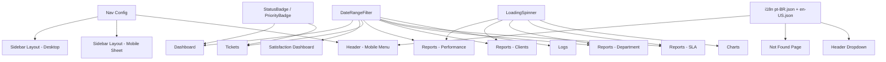

# Design: Correções de Consistência Visual (UI)

## Visão Geral

Este design detalha a solução técnica para corrigir inconsistências visuais no frontend do GestaoTickets. A abordagem é centralizar componentes reutilizáveis, eliminar duplicações e garantir que todas as telas respeitem tokens de tema e i18n. Nenhuma alteração de backend ou banco de dados é necessária — todas as mudanças são exclusivamente no frontend React/TypeScript.

## Arquitetura

A estratégia segue o princípio DRY (Don't Repeat Yourself):



## Componentes e Interfaces

### 1. DateRangeFilter (Expansão)

O componente existente em `client/src/components/ui/date-range-filter.tsx` já funciona corretamente no Dashboard e Satisfaction Dashboard. A interface atual é:

```typescript
interface DateRangeFilterProps {
  timeFilter: string;
  setTimeFilter: (value: string) => void;
  dateRange: { from: Date | undefined; to: Date | undefined };
  setDateRange: (range: { from: Date | undefined; to: Date | undefined }) => void;
  calendarOpen: boolean;
  setCalendarOpen: (open: boolean) => void;
}
```

A interface atual já é suficiente para todos os casos de uso. Não é necessário expandir o componente — apenas migrar as telas que reimplementam o mesmo comportamento.

Migração necessária:
- **Tickets** (`pages/tickets/index.tsx`): Remover o bloco `Popover + Calendar` inline (linhas ~349-400) e substituir por `<DateRangeFilter />`. O state `timeFilter`, `dateRange`, `calendarOpen` já existe na página.
- **Reports** (`pages/reports/performance.tsx`, `clients.tsx`, `department.tsx`, `sla.tsx`): Remover o `Popover + Calendar` inline e o botão "Aplicar Filtros". Adicionar states `timeFilter`, `calendarOpen` e usar `<DateRangeFilter />`. O filtro aplica automaticamente ao selecionar.
- **Logs** (`pages/logs.tsx`): Remover os dois `<Input type="date" />` e substituir por `<DateRangeFilter />`. Adicionar states necessários.

### 2. Nav Config (Novo)

Criar `client/src/lib/nav-config.ts` como fonte única de verdade para itens de navegação:

```typescript
import { LucideIcon } from 'lucide-react';

export interface NavItem {
  href: string;
  icon: LucideIcon;
  labelKey: string; // chave i18n, ex: 'sidebar.dashboard'
  roles: string[];
}

export interface InventoryNavItem {
  href: string;
  icon: LucideIcon;
  labelKey: string;
}

export const NAV_ITEMS: NavItem[] = [
  { href: "/", icon: LayoutDashboard, labelKey: 'sidebar.dashboard', roles: ['admin', 'support', 'customer', 'company_admin', 'manager', 'supervisor', 'viewer'] },
  { href: "/tickets", icon: TicketIcon, labelKey: 'sidebar.tickets', roles: ['admin', 'support', 'customer', 'company_admin', 'manager', 'supervisor', 'viewer'] },
  // ... todos os itens existentes na sidebar
];

export const INVENTORY_ITEMS: InventoryNavItem[] = [
  { href: "/inventory", icon: LayoutDashboard, labelKey: 'sidebar.inventory_overview' },
  // ... todos os itens de inventário existentes
];

export const INVENTORY_ROLES = ['admin', 'company_admin', 'manager', 'supervisor', 'support', 'inventory_manager'];

export function filterNavItems(items: NavItem[], userRole: string): NavItem[] {
  return items.filter(item => item.roles.includes(userRole));
}
```

Consumidores:
- `Sidebar` (`components/layout/sidebar.tsx`): Importar `NAV_ITEMS`, `INVENTORY_ITEMS`, `filterNavItems` e remover as definições inline de `navItems` e `inventoryMenuItems`.
- `Header` (`components/layout/header.tsx`): Importar `NAV_ITEMS`, `filterNavItems` e substituir os links hardcoded no `SheetContent` por iteração sobre os itens filtrados usando `formatMessage(item.labelKey)`.

### 3. LoadingSpinner (Novo)

Criar `client/src/components/ui/loading-spinner.tsx`:

```typescript
import React from 'react';
import { cn } from '@/lib/utils';

interface LoadingSpinnerProps {
  size?: 'sm' | 'md' | 'lg';
  className?: string;
}

export const LoadingSpinner: React.FC<LoadingSpinnerProps> = ({ size = 'md', className }) => {
  const sizeClasses = {
    sm: 'h-6 w-6',
    md: 'h-8 w-8',
    lg: 'h-12 w-12',
  };

  return (
    <div className={cn("animate-spin rounded-full border-b-2 border-primary", sizeClasses[size], className)} />
  );
};
```

Substituir em:
- `pages/reports/sla.tsx` (spinner `border-blue-500`)
- `pages/reports/clients.tsx` (spinner `border-blue-500`)
- `pages/reports/department.tsx` (spinner `border-blue-500`)
- `components/charts/modern-sla-bar-chart.tsx` (spinner `border-blue-500`)
- `components/charts/performance-bar-chart.tsx` (spinner `border-blue-500`)

### 4. Limpeza de utils.ts

Remover de `client/src/lib/utils.ts`:
- `PRIORITY_COLORS` (não utilizado em nenhum componente)
- `STATUS_COLORS` (não utilizado em nenhum componente)

Manter: `TICKET_STATUS`, `PRIORITY_LEVELS`, `PERIOD_OPTIONS`, `TICKET_TYPES`, `DEPARTMENTS` e demais funções utilitárias.

### 5. Página 404 (Correção)

Atualizar `client/src/pages/not-found.tsx`:
- Substituir `bg-gray-50` → `bg-background`
- Substituir `text-red-500` → `text-destructive`
- Substituir `text-gray-900` → `text-foreground`
- Substituir `text-gray-600` → `text-muted-foreground`
- Substituir textos em inglês por `formatMessage('not_found.title')`, `formatMessage('not_found.description')`

### 6. Header (Correção i18n)

Atualizar `client/src/components/layout/header.tsx`:
- Substituir menu mobile hardcoded por iteração sobre `NAV_ITEMS` filtrados
- Substituir "Minha Conta" → `formatMessage('header.my_account')`
- Substituir "Modo escuro" → `formatMessage('header.dark_mode')`
- Substituir "Configurações" → `formatMessage('header.settings')`
- Substituir "Sair" → `formatMessage('header.logout')`
- Substituir "Bem-vindo, {name}!" → `formatMessage('header.welcome', { name: currentUser.name })`

### 7. Correção de Cores Hardcoded em Charts

Nos componentes de gráficos, substituir cores hardcoded nos estados vazios e tooltips:
- `bg-white` → `bg-card` (tooltip)
- `border-gray-200` → `border-border` (tooltip)
- `text-gray-900` → `text-foreground`
- `text-gray-600` → `text-muted-foreground`
- `text-gray-500` → `text-muted-foreground`
- `text-gray-400` → `text-muted-foreground`
- `bg-gray-100` → `bg-muted`

Nota: As cores dos gradientes SVG dos gráficos (azul/verde para barras) são intencionais para diferenciação visual de séries de dados e não precisam ser migradas para tokens de tema.

## Modelos de Dados

Não há alterações em modelos de dados. Todas as mudanças são exclusivamente no frontend (componentes React, estilos CSS e arquivos de tradução).

### Chaves i18n Novas

Adicionar em `pt-BR.json` e `en-US.json`:

```json
{
  "header": {
    "welcome": "Bem-vindo, {name}!",
    "my_account": "Minha Conta",
    "dark_mode": "Modo escuro",
    "settings": "Configurações",
    "logout": "Sair"
  },
  "not_found": {
    "title": "Página não encontrada",
    "description": "A página que você está procurando não existe ou foi movida."
  }
}
```

```json
{
  "header": {
    "welcome": "Welcome, {name}!",
    "my_account": "My Account",
    "dark_mode": "Dark mode",
    "settings": "Settings",
    "logout": "Sign out"
  },
  "not_found": {
    "title": "Page not found",
    "description": "The page you are looking for does not exist or has been moved."
  }
}
```


## Propriedades de Corretude

*Uma propriedade é uma característica ou comportamento que deve ser verdadeiro em todas as execuções válidas de um sistema — essencialmente, uma declaração formal sobre o que o sistema deve fazer. Propriedades servem como ponte entre especificações legíveis por humanos e garantias de corretude verificáveis por máquina.*

A maioria dos requisitos desta feature são regras de refatoração e arquitetura (usar componente X em vez de Y, remover código duplicado), que não são testáveis como propriedades universais. A única propriedade genuína identificada é a consistência dos arquivos de tradução.

### Property 1: Paridade de chaves i18n entre pt-BR e en-US

*Para qualquer* chave presente no arquivo `pt-BR.json`, essa mesma chave deve existir no arquivo `en-US.json`, e vice-versa. Ou seja, o conjunto de chaves (incluindo chaves aninhadas) deve ser idêntico em ambos os arquivos.

**Validates: Requirements 5.5**

## Tratamento de Erros

Esta feature não introduz novos fluxos de erro. As correções são de apresentação visual e não alteram lógica de negócio. Os tratamentos de erro existentes (toast notifications, try/catch em mutations) permanecem inalterados.

Cenários de atenção:
- Se uma chave i18n não existir em um dos arquivos, `formatMessage` retorna a própria chave como fallback — comportamento já existente no sistema.
- O `DateRangeFilter` já trata o caso de datas undefined (exibe placeholder).

## Estratégia de Testes

### Testes de Propriedade (Property-Based)

- **Biblioteca**: `fast-check` (compatível com o ecossistema TypeScript/Vitest do projeto)
- **Configuração**: Mínimo 100 iterações por teste
- **Property 1**: Gerar chaves aleatórias e verificar que ambos os arquivos JSON contêm exatamente o mesmo conjunto de chaves aninhadas.
  - Tag: **Feature: ui-consistency-fixes, Property 1: Paridade de chaves i18n entre pt-BR e en-US**

### Testes Unitários (Exemplos)

Os testes unitários cobrem os exemplos identificados no prework:

1. **DateRangeFilter**: Verificar que renderiza as opções predefinidas, que abre o calendário ao selecionar "custom", e que fecha ao selecionar ambas as datas.
2. **LoadingSpinner**: Verificar que renderiza com classe `border-primary` e aceita os 3 tamanhos.
3. **Página 404**: Verificar que usa tokens de tema (sem classes hardcoded como `bg-gray-50`) e que usa `formatMessage` para textos.
4. **Nav Config**: Verificar que `filterNavItems` filtra corretamente por role.
5. **Header**: Verificar que o menu mobile usa `formatMessage` para labels.

### Abordagem Complementar

- Testes unitários validam exemplos específicos e edge cases
- Testes de propriedade validam a consistência universal dos arquivos i18n
- Juntos, cobrem tanto a corretude funcional dos componentes quanto a integridade dos dados de tradução
